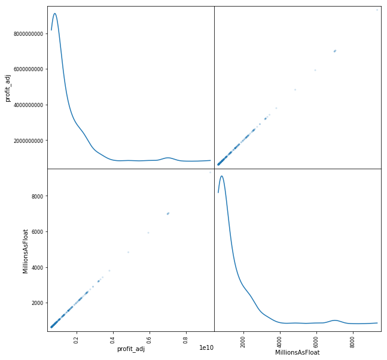
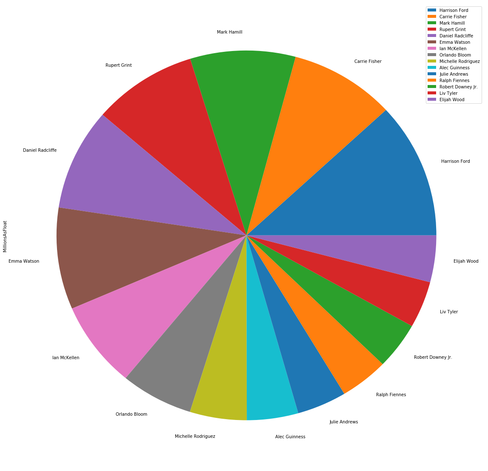
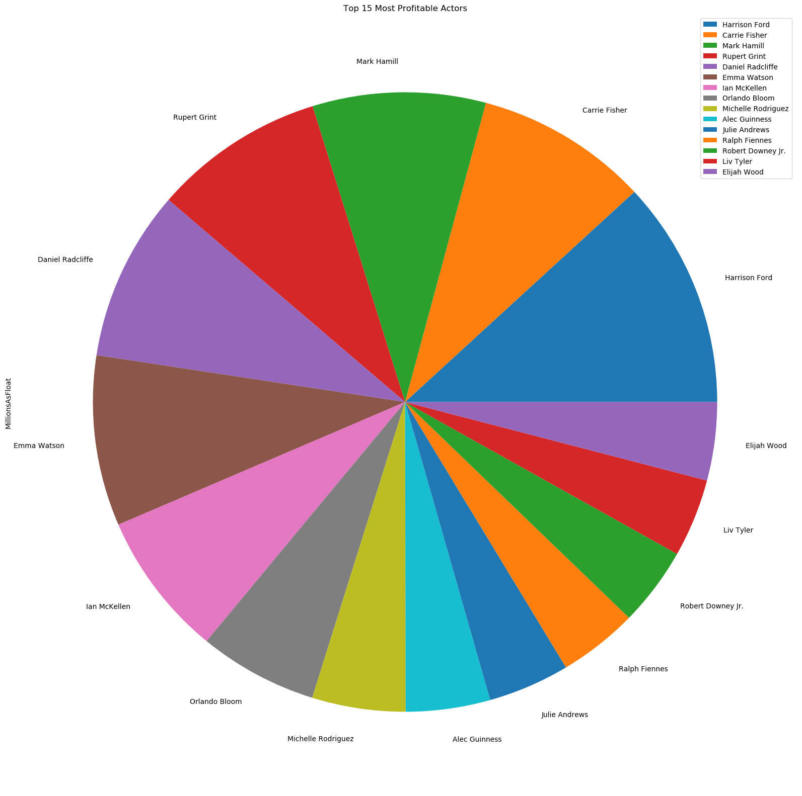
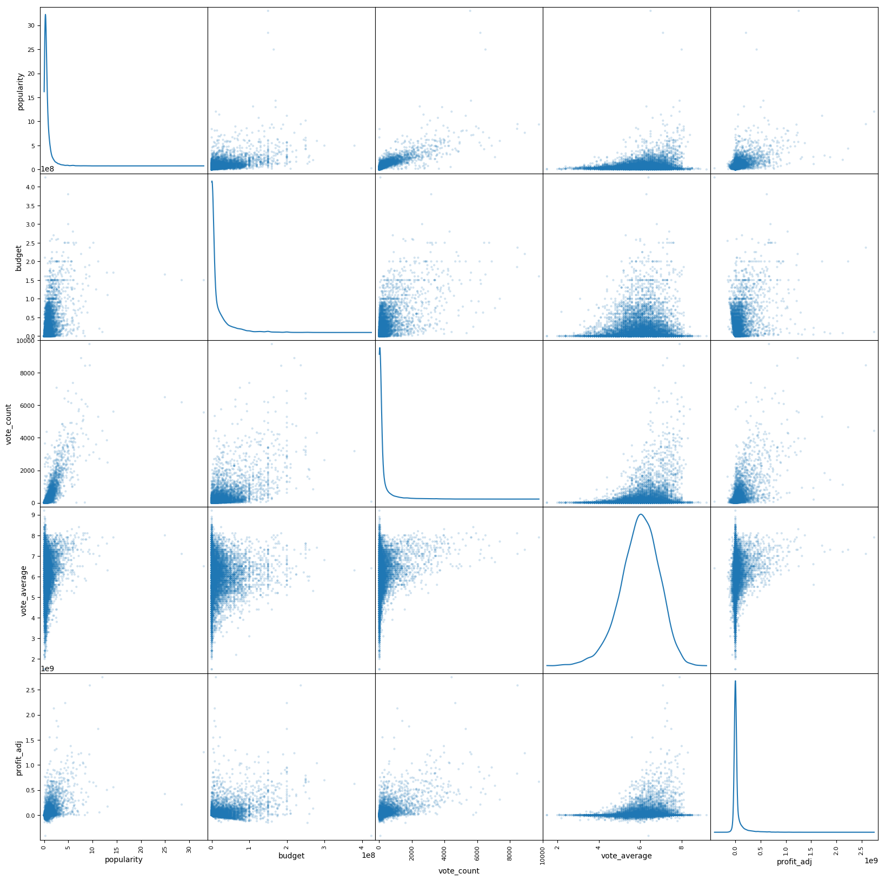
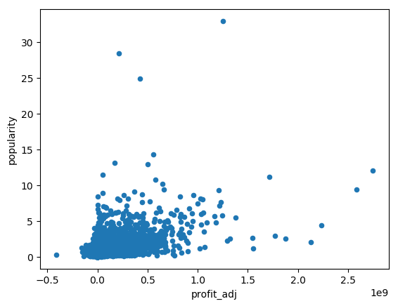
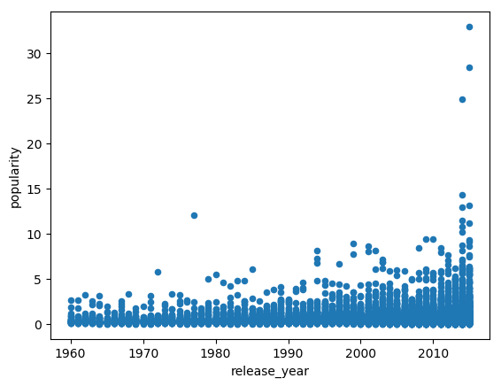
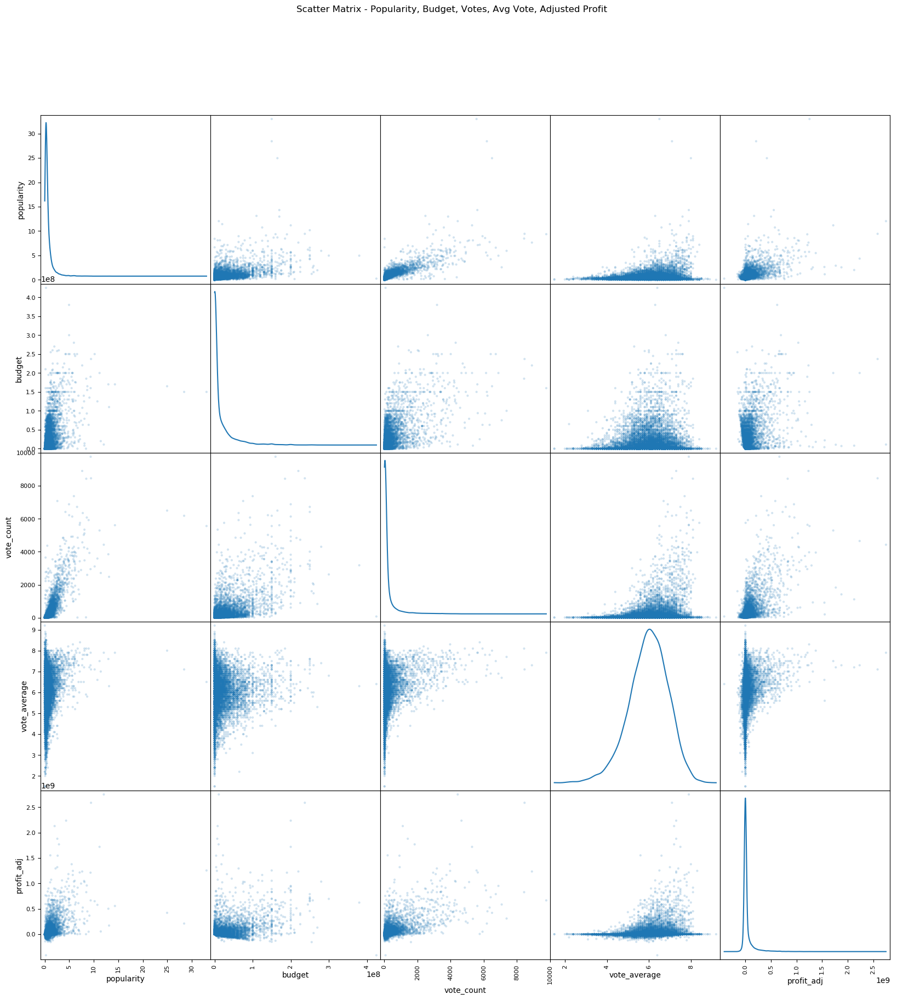
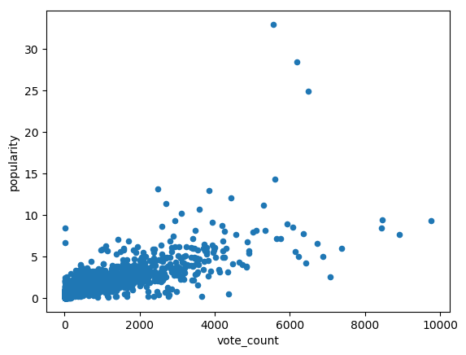
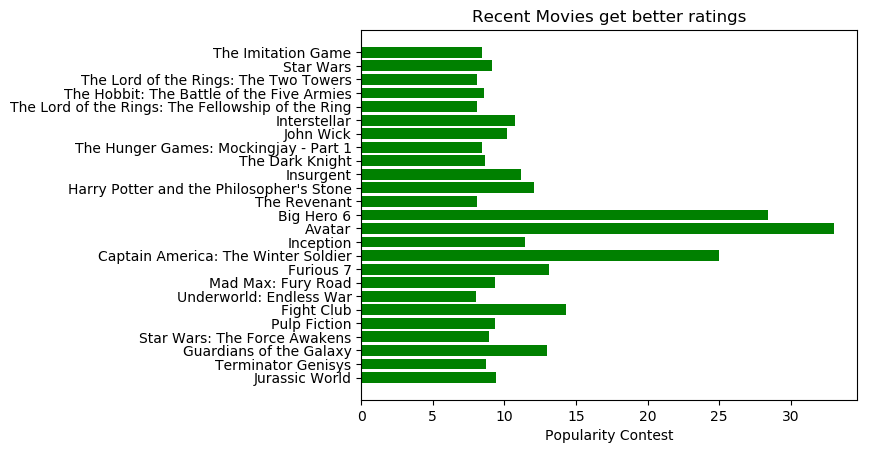

# Project: Movie Database Analysis

## Table of Contents
<ul>
<li><a href="#intro">Introduction</a></li>
<li><a href="#wrangling">Data Wrangling</a></li>
<li><a href="#eda">Exploratory Data Analysis</a></li>
<li><a href="#conclusions">Conclusions</a></li>
</ul>

<a id='intro'></a>
## Introduction

> **Tip**: In this section of the report, provide a brief introduction to the dataset you've selected for analysis. At the end of this section, describe the questions that you plan on exploring over the course of the report. Try to build your report around the analysis of at least one dependent variable and three independent variables.
>
> If you haven't yet selected and downloaded your data, make sure you do that first before coming back here. If you're not sure what questions to ask right now, then make sure you familiarize yourself with the variables and the dataset context for ideas of what to explore.


```python
import pandas as pd
import numpy as np
import matplotlib as plt
import matplotlib.pyplot as plt
%matplotlib inline

movie_df = pd.read_csv('tmdb-movies.csv')
movie_df.head()

```


<div>
<style scoped>
    .dataframe tbody tr th:only-of-type {
        vertical-align: middle;
    }

    .dataframe tbody tr th {
        vertical-align: top;
    }

    .dataframe thead th {
        text-align: right;
    }
</style>
<table border="1" class="dataframe">
  <thead>
    <tr style="text-align: right;">
      <th></th>
      <th>id</th>
      <th>imdb_id</th>
      <th>popularity</th>
      <th>budget</th>
      <th>revenue</th>
      <th>original_title</th>
      <th>cast</th>
      <th>homepage</th>
      <th>director</th>
      <th>tagline</th>
      <th>...</th>
      <th>overview</th>
      <th>runtime</th>
      <th>genres</th>
      <th>production_companies</th>
      <th>release_date</th>
      <th>vote_count</th>
      <th>vote_average</th>
      <th>release_year</th>
      <th>budget_adj</th>
      <th>revenue_adj</th>
    </tr>
  </thead>
  <tbody>
    <tr>
      <th>0</th>
      <td>135397</td>
      <td>tt0369610</td>
      <td>32.985763</td>
      <td>150000000</td>
      <td>1513528810</td>
      <td>Jurassic World</td>
      <td>Chris Pratt|Bryce Dallas Howard|Irrfan Khan|Vi...</td>
      <td>http://www.jurassicworld.com/</td>
      <td>Colin Trevorrow</td>
      <td>The park is open.</td>
      <td>...</td>
      <td>Twenty-two years after the events of Jurassic ...</td>
      <td>124</td>
      <td>Action|Adventure|Science Fiction|Thriller</td>
      <td>Universal Studios|Amblin Entertainment|Legenda...</td>
      <td>6/9/15</td>
      <td>5562</td>
      <td>6.5</td>
      <td>2015</td>
      <td>1.379999e+08</td>
      <td>1.392446e+09</td>
    </tr>
    <tr>
      <th>1</th>
      <td>76341</td>
      <td>tt1392190</td>
      <td>28.419936</td>
      <td>150000000</td>
      <td>378436354</td>
      <td>Mad Max: Fury Road</td>
      <td>Tom Hardy|Charlize Theron|Hugh Keays-Byrne|Nic...</td>
      <td>http://www.madmaxmovie.com/</td>
      <td>George Miller</td>
      <td>What a Lovely Day.</td>
      <td>...</td>
      <td>An apocalyptic story set in the furthest reach...</td>
      <td>120</td>
      <td>Action|Adventure|Science Fiction|Thriller</td>
      <td>Village Roadshow Pictures|Kennedy Miller Produ...</td>
      <td>5/13/15</td>
      <td>6185</td>
      <td>7.1</td>
      <td>2015</td>
      <td>1.379999e+08</td>
      <td>3.481613e+08</td>
    </tr>
    <tr>
      <th>2</th>
      <td>262500</td>
      <td>tt2908446</td>
      <td>13.112507</td>
      <td>110000000</td>
      <td>295238201</td>
      <td>Insurgent</td>
      <td>Shailene Woodley|Theo James|Kate Winslet|Ansel...</td>
      <td>http://www.thedivergentseries.movie/#insurgent</td>
      <td>Robert Schwentke</td>
      <td>One Choice Can Destroy You</td>
      <td>...</td>
      <td>Beatrice Prior must confront her inner demons ...</td>
      <td>119</td>
      <td>Adventure|Science Fiction|Thriller</td>
      <td>Summit Entertainment|Mandeville Films|Red Wago...</td>
      <td>3/18/15</td>
      <td>2480</td>
      <td>6.3</td>
      <td>2015</td>
      <td>1.012000e+08</td>
      <td>2.716190e+08</td>
    </tr>
    <tr>
      <th>3</th>
      <td>140607</td>
      <td>tt2488496</td>
      <td>11.173104</td>
      <td>200000000</td>
      <td>2068178225</td>
      <td>Star Wars: The Force Awakens</td>
      <td>Harrison Ford|Mark Hamill|Carrie Fisher|Adam D...</td>
      <td>http://www.starwars.com/films/star-wars-episod...</td>
      <td>J.J. Abrams</td>
      <td>Every generation has a story.</td>
      <td>...</td>
      <td>Thirty years after defeating the Galactic Empi...</td>
      <td>136</td>
      <td>Action|Adventure|Science Fiction|Fantasy</td>
      <td>Lucasfilm|Truenorth Productions|Bad Robot</td>
      <td>12/15/15</td>
      <td>5292</td>
      <td>7.5</td>
      <td>2015</td>
      <td>1.839999e+08</td>
      <td>1.902723e+09</td>
    </tr>
    <tr>
      <th>4</th>
      <td>168259</td>
      <td>tt2820852</td>
      <td>9.335014</td>
      <td>190000000</td>
      <td>1506249360</td>
      <td>Furious 7</td>
      <td>Vin Diesel|Paul Walker|Jason Statham|Michelle ...</td>
      <td>http://www.furious7.com/</td>
      <td>James Wan</td>
      <td>Vengeance Hits Home</td>
      <td>...</td>
      <td>Deckard Shaw seeks revenge against Dominic Tor...</td>
      <td>137</td>
      <td>Action|Crime|Thriller</td>
      <td>Universal Pictures|Original Film|Media Rights ...</td>
      <td>4/1/15</td>
      <td>2947</td>
      <td>7.3</td>
      <td>2015</td>
      <td>1.747999e+08</td>
      <td>1.385749e+09</td>
    </tr>
  </tbody>
</table>
<p>5 rows × 21 columns</p>
</div>


<a id='wrangling'></a>
## Data Wrangling

> **Tip**: In this section of the report, you will load in the data, check for cleanliness, and then trim and clean your dataset for analysis. Make sure that you document your steps carefully and justify your cleaning decisions.

### General Properties


```python
# Load your data and print out a few lines. Perform operations to inspect data
#   types and look for instances of missing or possibly errant data.

#missing data - movie_df.info()
#duplicates - 
#incorrect types - 
movie_df.info()
movie_df.duplicated()
```


    

    AttributeErrorTraceback (most recent call last)

    <ipython-input-38-2c9669645d3a> in <module>()
          5 #duplicates -
          6 #incorrect types -
    ----> 7 movie_df.info()
          8 movie_df.duplicated()


    /opt/conda/envs/DataAnalyticsClass/lib/python3.6/site-packages/pandas/core/generic.py in __getattr__(self, name)
       3612             if name in self._info_axis:
       3613                 return self[name]
    -> 3614             return object.__getattribute__(self, name)
       3615 
       3616     def __setattr__(self, name, value):


    AttributeError: 'Series' object has no attribute 'info'


> **Tip**: You should _not_ perform too many operations in each cell. Create cells freely to explore your data. One option that you can take with this project is to do a lot of explorations in an initial notebook. These don't have to be organized, but make sure you use enough comments to understand the purpose of each code cell. Then, after you're done with your analysis, create a duplicate notebook where you will trim the excess and organize your steps so that you have a flowing, cohesive report.

> **Tip**: Make sure that you keep your reader informed on the steps that you are taking in your investigation. Follow every code cell, or every set of related code cells, with a markdown cell to describe to the reader what was found in the preceding cell(s). Try to make it so that the reader can then understand what they will be seeing in the following cell(s).

### Data Cleaning (Replace this with more specific notes!)


```python
#Missing data is not an issue as it can't be filled with anything to provide useful analysis. We care about Budget, Revenue, and Cast
#I do need to find a way to search on a cast member.
cast_movie_df = movie_df['cast'].str.replace('|',',')
new_df = cast_movie_df.str.split(',',4, expand=True)
new_df.to_csv('cast.csv', index=False,header=['cast_member1','cast_member2','cast_member3','cast_member4','cast_member5'])
fixed_cast_df = pd.read_csv('cast.csv')

```

### Compute Profit for each movie in the database


```python
df_prof = clean_movie_df['revenue'] - clean_movie_df['budget']
df_prof.to_csv('profit.csv', index=False,header=['profit'])

```


```python
#adjusted

df_adj= clean_movie_df['revenue_adj'] - clean_movie_df['budget_adj']
df_adj.to_csv('profit_adj.csv', index=False,header=['profit_adj'])
```


```python
#get the cleaned and modified data
fixed_prof_df = pd.read_csv('profit.csv')
fixed_prof_adj_df = pd.read_csv('profit_adj.csv')
clean_movie_df = pd.concat([movie_df, fixed_cast_df, fixed_prof_df,fixed_prof_adj_df], axis=1)
clean_movie_df.head()
```


<div>
<style scoped>
    .dataframe tbody tr th:only-of-type {
        vertical-align: middle;
    }

    .dataframe tbody tr th {
        vertical-align: top;
    }

    .dataframe thead th {
        text-align: right;
    }
</style>
<table border="1" class="dataframe">
  <thead>
    <tr style="text-align: right;">
      <th></th>
      <th>id</th>
      <th>imdb_id</th>
      <th>popularity</th>
      <th>budget</th>
      <th>revenue</th>
      <th>original_title</th>
      <th>cast</th>
      <th>homepage</th>
      <th>director</th>
      <th>tagline</th>
      <th>...</th>
      <th>release_year</th>
      <th>budget_adj</th>
      <th>revenue_adj</th>
      <th>cast_member1</th>
      <th>cast_member2</th>
      <th>cast_member3</th>
      <th>cast_member4</th>
      <th>cast_member5</th>
      <th>profit</th>
      <th>profit_adj</th>
    </tr>
  </thead>
  <tbody>
    <tr>
      <th>0</th>
      <td>135397</td>
      <td>tt0369610</td>
      <td>32.985763</td>
      <td>150000000</td>
      <td>1513528810</td>
      <td>Jurassic World</td>
      <td>Chris Pratt|Bryce Dallas Howard|Irrfan Khan|Vi...</td>
      <td>http://www.jurassicworld.com/</td>
      <td>Colin Trevorrow</td>
      <td>The park is open.</td>
      <td>...</td>
      <td>2015</td>
      <td>1.379999e+08</td>
      <td>1.392446e+09</td>
      <td>Chris Pratt</td>
      <td>Bryce Dallas Howard</td>
      <td>Irrfan Khan</td>
      <td>Vincent D'Onofrio</td>
      <td>Nick Robinson</td>
      <td>1363528810</td>
      <td>1.254446e+09</td>
    </tr>
    <tr>
      <th>1</th>
      <td>76341</td>
      <td>tt1392190</td>
      <td>28.419936</td>
      <td>150000000</td>
      <td>378436354</td>
      <td>Mad Max: Fury Road</td>
      <td>Tom Hardy|Charlize Theron|Hugh Keays-Byrne|Nic...</td>
      <td>http://www.madmaxmovie.com/</td>
      <td>George Miller</td>
      <td>What a Lovely Day.</td>
      <td>...</td>
      <td>2015</td>
      <td>1.379999e+08</td>
      <td>3.481613e+08</td>
      <td>Tom Hardy</td>
      <td>Charlize Theron</td>
      <td>Hugh Keays-Byrne</td>
      <td>Nicholas Hoult</td>
      <td>Josh Helman</td>
      <td>228436354</td>
      <td>2.101614e+08</td>
    </tr>
    <tr>
      <th>2</th>
      <td>262500</td>
      <td>tt2908446</td>
      <td>13.112507</td>
      <td>110000000</td>
      <td>295238201</td>
      <td>Insurgent</td>
      <td>Shailene Woodley|Theo James|Kate Winslet|Ansel...</td>
      <td>http://www.thedivergentseries.movie/#insurgent</td>
      <td>Robert Schwentke</td>
      <td>One Choice Can Destroy You</td>
      <td>...</td>
      <td>2015</td>
      <td>1.012000e+08</td>
      <td>2.716190e+08</td>
      <td>Shailene Woodley</td>
      <td>Theo James</td>
      <td>Kate Winslet</td>
      <td>Ansel Elgort</td>
      <td>Miles Teller</td>
      <td>185238201</td>
      <td>1.704191e+08</td>
    </tr>
    <tr>
      <th>3</th>
      <td>140607</td>
      <td>tt2488496</td>
      <td>11.173104</td>
      <td>200000000</td>
      <td>2068178225</td>
      <td>Star Wars: The Force Awakens</td>
      <td>Harrison Ford|Mark Hamill|Carrie Fisher|Adam D...</td>
      <td>http://www.starwars.com/films/star-wars-episod...</td>
      <td>J.J. Abrams</td>
      <td>Every generation has a story.</td>
      <td>...</td>
      <td>2015</td>
      <td>1.839999e+08</td>
      <td>1.902723e+09</td>
      <td>Harrison Ford</td>
      <td>Mark Hamill</td>
      <td>Carrie Fisher</td>
      <td>Adam Driver</td>
      <td>Daisy Ridley</td>
      <td>1868178225</td>
      <td>1.718723e+09</td>
    </tr>
    <tr>
      <th>4</th>
      <td>168259</td>
      <td>tt2820852</td>
      <td>9.335014</td>
      <td>190000000</td>
      <td>1506249360</td>
      <td>Furious 7</td>
      <td>Vin Diesel|Paul Walker|Jason Statham|Michelle ...</td>
      <td>http://www.furious7.com/</td>
      <td>James Wan</td>
      <td>Vengeance Hits Home</td>
      <td>...</td>
      <td>2015</td>
      <td>1.747999e+08</td>
      <td>1.385749e+09</td>
      <td>Vin Diesel</td>
      <td>Paul Walker</td>
      <td>Jason Statham</td>
      <td>Michelle Rodriguez</td>
      <td>Dwayne Johnson</td>
      <td>1316249360</td>
      <td>1.210949e+09</td>
    </tr>
  </tbody>
</table>
<p>5 rows × 28 columns</p>
</div>


```python
# Use this, and more code cells, to explore your data. Don't forget to add
#   Markdown cells to document your observations and findings.
clean_movie_df.sort_values(['profit_adj'], ascending=False)
```


<div>
<style scoped>
    .dataframe tbody tr th:only-of-type {
        vertical-align: middle;
    }

    .dataframe tbody tr th {
        vertical-align: top;
    }

    .dataframe thead th {
        text-align: right;
    }
</style>
<table border="1" class="dataframe">
  <thead>
    <tr style="text-align: right;">
      <th></th>
      <th>id</th>
      <th>imdb_id</th>
      <th>popularity</th>
      <th>budget</th>
      <th>revenue</th>
      <th>original_title</th>
      <th>cast</th>
      <th>homepage</th>
      <th>director</th>
      <th>tagline</th>
      <th>...</th>
      <th>release_year</th>
      <th>budget_adj</th>
      <th>revenue_adj</th>
      <th>cast_member1</th>
      <th>cast_member2</th>
      <th>cast_member3</th>
      <th>cast_member4</th>
      <th>cast_member5</th>
      <th>profit</th>
      <th>profit_adj</th>
    </tr>
  </thead>
  <tbody>
    <tr>
      <th>1329</th>
      <td>11</td>
      <td>tt0076759</td>
      <td>12.037933</td>
      <td>11000000</td>
      <td>775398007</td>
      <td>Star Wars</td>
      <td>Mark Hamill|Harrison Ford|Carrie Fisher|Peter ...</td>
      <td>http://www.starwars.com/films/star-wars-episod...</td>
      <td>George Lucas</td>
      <td>A long time ago in a galaxy far, far away...</td>
      <td>...</td>
      <td>1977</td>
      <td>3.957559e+07</td>
      <td>2.789712e+09</td>
      <td>Mark Hamill</td>
      <td>Harrison Ford</td>
      <td>Carrie Fisher</td>
      <td>Peter Cushing</td>
      <td>Alec Guinness</td>
      <td>764398007</td>
      <td>2.750137e+09</td>
    </tr>
    <tr>
      <th>1386</th>
      <td>19995</td>
      <td>tt0499549</td>
      <td>9.432768</td>
      <td>237000000</td>
      <td>2781505847</td>
      <td>Avatar</td>
      <td>Sam Worthington|Zoe Saldana|Sigourney Weaver|S...</td>
      <td>http://www.avatarmovie.com/</td>
      <td>James Cameron</td>
      <td>Enter the World of Pandora.</td>
      <td>...</td>
      <td>2009</td>
      <td>2.408869e+08</td>
      <td>2.827124e+09</td>
      <td>Sam Worthington</td>
      <td>Zoe Saldana</td>
      <td>Sigourney Weaver</td>
      <td>Stephen Lang</td>
      <td>Michelle Rodriguez</td>
      <td>2544505847</td>
      <td>2.586237e+09</td>
    </tr>
    <tr>
      <th>5231</th>
      <td>597</td>
      <td>tt0120338</td>
      <td>4.355219</td>
      <td>200000000</td>
      <td>1845034188</td>
      <td>Titanic</td>
      <td>Kate Winslet|Leonardo DiCaprio|Frances Fisher|...</td>
      <td>http://www.titanicmovie.com/menu.html</td>
      <td>James Cameron</td>
      <td>Nothing on Earth could come between them.</td>
      <td>...</td>
      <td>1997</td>
      <td>2.716921e+08</td>
      <td>2.506406e+09</td>
      <td>Kate Winslet</td>
      <td>Leonardo DiCaprio</td>
      <td>Frances Fisher</td>
      <td>Billy Zane</td>
      <td>Kathy Bates</td>
      <td>1645034188</td>
      <td>2.234714e+09</td>
    </tr>
    <tr>
      <th>10594</th>
      <td>9552</td>
      <td>tt0070047</td>
      <td>2.010733</td>
      <td>8000000</td>
      <td>441306145</td>
      <td>The Exorcist</td>
      <td>Linda Blair|Max von Sydow|Ellen Burstyn|Jason ...</td>
      <td>http://theexorcist.warnerbros.com/</td>
      <td>William Friedkin</td>
      <td>Something almost beyond comprehension is happe...</td>
      <td>...</td>
      <td>1973</td>
      <td>3.928928e+07</td>
      <td>2.167325e+09</td>
      <td>Linda Blair</td>
      <td>Max von Sydow</td>
      <td>Ellen Burstyn</td>
      <td>Jason Miller</td>
      <td>Lee J. Cobb</td>
      <td>433306145</td>
      <td>2.128036e+09</td>
    </tr>
    <tr>
      <th>9806</th>
      <td>578</td>
      <td>tt0073195</td>
      <td>2.563191</td>
      <td>7000000</td>
      <td>470654000</td>
      <td>Jaws</td>
      <td>Roy Scheider|Robert Shaw|Richard Dreyfuss|Lorr...</td>
      <td>http://www.jaws25.com/</td>
      <td>Steven Spielberg</td>
      <td>Don't go in the water.</td>
      <td>...</td>
      <td>1975</td>
      <td>2.836275e+07</td>
      <td>1.907006e+09</td>
      <td>Roy Scheider</td>
      <td>Robert Shaw</td>
      <td>Richard Dreyfuss</td>
      <td>Lorraine Gary</td>
      <td>Murray Hamilton</td>
      <td>463654000</td>
      <td>1.878643e+09</td>
    </tr>
    <tr>
      <th>8889</th>
      <td>601</td>
      <td>tt0083866</td>
      <td>2.900556</td>
      <td>10500000</td>
      <td>792910554</td>
      <td>E.T. the Extra-Terrestrial</td>
      <td>Henry Thomas|Drew Barrymore|Robert MacNaughton...</td>
      <td>http://www.et20.com/</td>
      <td>Steven Spielberg</td>
      <td>He is afraid. He is alone. He is three million...</td>
      <td>...</td>
      <td>1982</td>
      <td>2.372625e+07</td>
      <td>1.791694e+09</td>
      <td>Henry Thomas</td>
      <td>Drew Barrymore</td>
      <td>Robert MacNaughton</td>
      <td>Dee Wallace</td>
      <td>Peter Coyote</td>
      <td>782410554</td>
      <td>1.767968e+09</td>
    </tr>
    <tr>
      <th>3</th>
      <td>140607</td>
      <td>tt2488496</td>
      <td>11.173104</td>
      <td>200000000</td>
      <td>2068178225</td>
      <td>Star Wars: The Force Awakens</td>
      <td>Harrison Ford|Mark Hamill|Carrie Fisher|Adam D...</td>
      <td>http://www.starwars.com/films/star-wars-episod...</td>
      <td>J.J. Abrams</td>
      <td>Every generation has a story.</td>
      <td>...</td>
      <td>2015</td>
      <td>1.839999e+08</td>
      <td>1.902723e+09</td>
      <td>Harrison Ford</td>
      <td>Mark Hamill</td>
      <td>Carrie Fisher</td>
      <td>Adam Driver</td>
      <td>Daisy Ridley</td>
      <td>1868178225</td>
      <td>1.718723e+09</td>
    </tr>
    <tr>
      <th>8094</th>
      <td>1642</td>
      <td>tt0113957</td>
      <td>1.136610</td>
      <td>22000000</td>
      <td>1106279658</td>
      <td>The Net</td>
      <td>Sandra Bullock|Jeremy Northam|Dennis Miller|We...</td>
      <td>NaN</td>
      <td>Irwin Winkler</td>
      <td>Her driver's license. Her credit cards. Her ba...</td>
      <td>...</td>
      <td>1995</td>
      <td>3.148127e+07</td>
      <td>1.583050e+09</td>
      <td>Sandra Bullock</td>
      <td>Jeremy Northam</td>
      <td>Dennis Miller</td>
      <td>Wendy Gazelle</td>
      <td>Ken Howard</td>
      <td>1084279658</td>
      <td>1.551568e+09</td>
    </tr>
    <tr>
      <th>10110</th>
      <td>12230</td>
      <td>tt0055254</td>
      <td>2.631987</td>
      <td>4000000</td>
      <td>215880014</td>
      <td>One Hundred and One Dalmatians</td>
      <td>Rod Taylor|J. Pat O'Malley|Betty Lou Gerson|Ma...</td>
      <td>NaN</td>
      <td>Clyde Geronimi|Hamilton Luske|Wolfgang Reitherman</td>
      <td>The Canine Caper of the Century</td>
      <td>...</td>
      <td>1961</td>
      <td>2.917944e+07</td>
      <td>1.574815e+09</td>
      <td>Rod Taylor</td>
      <td>J. Pat O'Malley</td>
      <td>Betty Lou Gerson</td>
      <td>Martha Wentworth</td>
      <td>Ben Wright</td>
      <td>211880014</td>
      <td>1.545635e+09</td>
    </tr>
    <tr>
      <th>7309</th>
      <td>1891</td>
      <td>tt0080684</td>
      <td>5.488441</td>
      <td>18000000</td>
      <td>538400000</td>
      <td>The Empire Strikes Back</td>
      <td>Mark Hamill|Harrison Ford|Carrie Fisher|Billy ...</td>
      <td>http://www.starwars.com/films/star-wars-episod...</td>
      <td>Irvin Kershner</td>
      <td>The Adventure Continues...</td>
      <td>...</td>
      <td>1980</td>
      <td>4.762866e+07</td>
      <td>1.424626e+09</td>
      <td>Mark Hamill</td>
      <td>Harrison Ford</td>
      <td>Carrie Fisher</td>
      <td>Billy Dee Williams</td>
      <td>Anthony Daniels</td>
      <td>520400000</td>
      <td>1.376998e+09</td>
    </tr>
    <tr>
      <th>10398</th>
      <td>9325</td>
      <td>tt0061852</td>
      <td>2.550704</td>
      <td>4000000</td>
      <td>205843612</td>
      <td>The Jungle Book</td>
      <td>Phil Harris|Sebastian Cabot|Louis Prima|George...</td>
      <td>NaN</td>
      <td>Wolfgang Reitherman</td>
      <td>The Jungle is JUMPIN'!</td>
      <td>...</td>
      <td>1967</td>
      <td>2.614705e+07</td>
      <td>1.345551e+09</td>
      <td>Phil Harris</td>
      <td>Sebastian Cabot</td>
      <td>Louis Prima</td>
      <td>George Sanders</td>
      <td>Sterling Holloway</td>
      <td>201843612</td>
      <td>1.319404e+09</td>
    </tr>
    <tr>
      <th>10223</th>
      <td>329</td>
      <td>tt0107290</td>
      <td>2.204926</td>
      <td>63000000</td>
      <td>920100000</td>
      <td>Jurassic Park</td>
      <td>Sam Neill|Laura Dern|Jeff Goldblum|Richard Att...</td>
      <td>http://www.jurassicpark.com/</td>
      <td>Steven Spielberg</td>
      <td>An adventure 65 million years in the making.</td>
      <td>...</td>
      <td>1993</td>
      <td>9.509661e+07</td>
      <td>1.388863e+09</td>
      <td>Sam Neill</td>
      <td>Laura Dern</td>
      <td>Jeff Goldblum</td>
      <td>Richard Attenborough</td>
      <td>Bob Peck</td>
      <td>857100000</td>
      <td>1.293767e+09</td>
    </tr>
    <tr>
      <th>0</th>
      <td>135397</td>
      <td>tt0369610</td>
      <td>32.985763</td>
      <td>150000000</td>
      <td>1513528810</td>
      <td>Jurassic World</td>
      <td>Chris Pratt|Bryce Dallas Howard|Irrfan Khan|Vi...</td>
      <td>http://www.jurassicworld.com/</td>
      <td>Colin Trevorrow</td>
      <td>The park is open.</td>
      <td>...</td>
      <td>2015</td>
      <td>1.379999e+08</td>
      <td>1.392446e+09</td>
      <td>Chris Pratt</td>
      <td>Bryce Dallas Howard</td>
      <td>Irrfan Khan</td>
      <td>Vincent D'Onofrio</td>
      <td>Nick Robinson</td>
      <td>1363528810</td>
      <td>1.254446e+09</td>
    </tr>
    <tr>
      <th>7269</th>
      <td>238</td>
      <td>tt0068646</td>
      <td>5.738034</td>
      <td>6000000</td>
      <td>245066411</td>
      <td>The Godfather</td>
      <td>Marlon Brando|Al Pacino|James Caan|Richard S. ...</td>
      <td>http://www.thegodfather.com/</td>
      <td>Francis Ford Coppola</td>
      <td>An offer you can't refuse.</td>
      <td>...</td>
      <td>1972</td>
      <td>3.128737e+07</td>
      <td>1.277914e+09</td>
      <td>Marlon Brando</td>
      <td>Al Pacino</td>
      <td>James Caan</td>
      <td>Richard S. Castellano</td>
      <td>Robert Duvall</td>
      <td>239066411</td>
      <td>1.246626e+09</td>
    </tr>
    <tr>
      <th>4361</th>
      <td>24428</td>
      <td>tt0848228</td>
      <td>7.637767</td>
      <td>220000000</td>
      <td>1519557910</td>
      <td>The Avengers</td>
      <td>Robert Downey Jr.|Chris Evans|Mark Ruffalo|Chr...</td>
      <td>http://marvel.com/avengers_movie/</td>
      <td>Joss Whedon</td>
      <td>Some assembly required.</td>
      <td>...</td>
      <td>2012</td>
      <td>2.089437e+08</td>
      <td>1.443191e+09</td>
      <td>Robert Downey Jr.</td>
      <td>Chris Evans</td>
      <td>Mark Ruffalo</td>
      <td>Chris Hemsworth</td>
      <td>Scarlett Johansson</td>
      <td>1299557910</td>
      <td>1.234248e+09</td>
    </tr>
    <tr>
      <th>4949</th>
      <td>122</td>
      <td>tt0167260</td>
      <td>7.122455</td>
      <td>94000000</td>
      <td>1118888979</td>
      <td>The Lord of the Rings: The Return of the King</td>
      <td>Elijah Wood|Ian McKellen|Viggo Mortensen|Liv T...</td>
      <td>http://www.lordoftherings.net</td>
      <td>Peter Jackson</td>
      <td>The eye of the enemy is moving.</td>
      <td>...</td>
      <td>2003</td>
      <td>1.114231e+08</td>
      <td>1.326278e+09</td>
      <td>Elijah Wood</td>
      <td>Ian McKellen</td>
      <td>Viggo Mortensen</td>
      <td>Liv Tyler</td>
      <td>Orlando Bloom</td>
      <td>1024888979</td>
      <td>1.214855e+09</td>
    </tr>
    <tr>
      <th>4</th>
      <td>168259</td>
      <td>tt2820852</td>
      <td>9.335014</td>
      <td>190000000</td>
      <td>1506249360</td>
      <td>Furious 7</td>
      <td>Vin Diesel|Paul Walker|Jason Statham|Michelle ...</td>
      <td>http://www.furious7.com/</td>
      <td>James Wan</td>
      <td>Vengeance Hits Home</td>
      <td>...</td>
      <td>2015</td>
      <td>1.747999e+08</td>
      <td>1.385749e+09</td>
      <td>Vin Diesel</td>
      <td>Paul Walker</td>
      <td>Jason Statham</td>
      <td>Michelle Rodriguez</td>
      <td>Dwayne Johnson</td>
      <td>1316249360</td>
      <td>1.210949e+09</td>
    </tr>
    <tr>
      <th>7987</th>
      <td>1892</td>
      <td>tt0086190</td>
      <td>4.828854</td>
      <td>32350000</td>
      <td>572700000</td>
      <td>Return of the Jedi</td>
      <td>Mark Hamill|Harrison Ford|Carrie Fisher|Billy ...</td>
      <td>http://www.starwars.com/films/star-wars-episod...</td>
      <td>Richard Marquand</td>
      <td>The Empire Falls...</td>
      <td>...</td>
      <td>1983</td>
      <td>7.082424e+07</td>
      <td>1.253819e+09</td>
      <td>Mark Hamill</td>
      <td>Harrison Ford</td>
      <td>Carrie Fisher</td>
      <td>Billy Dee Williams</td>
      <td>Anthony Daniels</td>
      <td>540350000</td>
      <td>1.182995e+09</td>
    </tr>
    <tr>
      <th>3374</th>
      <td>12445</td>
      <td>tt1201607</td>
      <td>5.711315</td>
      <td>125000000</td>
      <td>1327817822</td>
      <td>Harry Potter and the Deathly Hallows: Part 2</td>
      <td>Daniel Radcliffe|Rupert Grint|Emma Watson|Alan...</td>
      <td>http://www.harrypotter.com</td>
      <td>David Yates</td>
      <td>It all ends here.</td>
      <td>...</td>
      <td>2011</td>
      <td>1.211748e+08</td>
      <td>1.287184e+09</td>
      <td>Daniel Radcliffe</td>
      <td>Rupert Grint</td>
      <td>Emma Watson</td>
      <td>Alan Rickman</td>
      <td>Maggie Smith</td>
      <td>1202817822</td>
      <td>1.166009e+09</td>
    </tr>
    <tr>
      <th>4180</th>
      <td>8587</td>
      <td>tt0110357</td>
      <td>4.782688</td>
      <td>45000000</td>
      <td>788241776</td>
      <td>The Lion King</td>
      <td>Jonathan Taylor Thomas|Matthew Broderick|James...</td>
      <td>http://movies.disney.com/the-lion-king</td>
      <td>Roger Allers|Rob Minkoff</td>
      <td>Life's greatest adventure is finding your plac...</td>
      <td>...</td>
      <td>1994</td>
      <td>6.620002e+07</td>
      <td>1.159592e+09</td>
      <td>Jonathan Taylor Thomas</td>
      <td>Matthew Broderick</td>
      <td>James Earl Jones</td>
      <td>Jeremy Irons</td>
      <td>Moira Kelly</td>
      <td>743241776</td>
      <td>1.093392e+09</td>
    </tr>
    <tr>
      <th>10690</th>
      <td>15121</td>
      <td>tt0059742</td>
      <td>1.313676</td>
      <td>8200000</td>
      <td>163214286</td>
      <td>The Sound of Music</td>
      <td>Julie Andrews|Christopher Plummer|Eleanor Park...</td>
      <td>NaN</td>
      <td>Robert Wise</td>
      <td>The happiest sound in all the world!</td>
      <td>...</td>
      <td>1965</td>
      <td>5.674862e+07</td>
      <td>1.129535e+09</td>
      <td>Julie Andrews</td>
      <td>Christopher Plummer</td>
      <td>Eleanor Parker</td>
      <td>Richard Haydn</td>
      <td>Peggy Wood</td>
      <td>155014286</td>
      <td>1.072786e+09</td>
    </tr>
    <tr>
      <th>2412</th>
      <td>1893</td>
      <td>tt0120915</td>
      <td>3.526029</td>
      <td>115000000</td>
      <td>924317558</td>
      <td>Star Wars: Episode I - The Phantom Menace</td>
      <td>Liam Neeson|Ewan McGregor|Natalie Portman|Jake...</td>
      <td>http://www.starwars.com/films/star-wars-episod...</td>
      <td>George Lucas</td>
      <td>Every generation has a legend. Every journey h...</td>
      <td>...</td>
      <td>1999</td>
      <td>1.505411e+08</td>
      <td>1.209981e+09</td>
      <td>Liam Neeson</td>
      <td>Ewan McGregor</td>
      <td>Natalie Portman</td>
      <td>Jake Lloyd</td>
      <td>Ian McDiarmid</td>
      <td>809317558</td>
      <td>1.059439e+09</td>
    </tr>
    <tr>
      <th>5422</th>
      <td>109445</td>
      <td>tt2294629</td>
      <td>6.112766</td>
      <td>150000000</td>
      <td>1274219009</td>
      <td>Frozen</td>
      <td>Kristen Bell|Idina Menzel|Jonathan Groff|Josh ...</td>
      <td>http://movies.disney.com/frozen</td>
      <td>Chris Buck|Jennifer Lee</td>
      <td>Only the act of true love will thaw a frozen h...</td>
      <td>...</td>
      <td>2013</td>
      <td>1.404050e+08</td>
      <td>1.192711e+09</td>
      <td>Kristen Bell</td>
      <td>Idina Menzel</td>
      <td>Jonathan Groff</td>
      <td>Josh Gad</td>
      <td>Santino Fontana</td>
      <td>1124219009</td>
      <td>1.052306e+09</td>
    </tr>
    <tr>
      <th>2634</th>
      <td>671</td>
      <td>tt0241527</td>
      <td>8.021423</td>
      <td>125000000</td>
      <td>976475550</td>
      <td>Harry Potter and the Philosopher's Stone</td>
      <td>Daniel Radcliffe|Rupert Grint|Emma Watson|John...</td>
      <td>http://harrypotter.warnerbros.com/harrypottera...</td>
      <td>Chris Columbus</td>
      <td>Let the Magic Begin.</td>
      <td>...</td>
      <td>2001</td>
      <td>1.539360e+08</td>
      <td>1.202518e+09</td>
      <td>Daniel Radcliffe</td>
      <td>Rupert Grint</td>
      <td>Emma Watson</td>
      <td>John Cleese</td>
      <td>Robbie Coltrane</td>
      <td>851475550</td>
      <td>1.048582e+09</td>
    </tr>
    <tr>
      <th>14</th>
      <td>99861</td>
      <td>tt2395427</td>
      <td>5.944927</td>
      <td>280000000</td>
      <td>1405035767</td>
      <td>Avengers: Age of Ultron</td>
      <td>Robert Downey Jr.|Chris Hemsworth|Mark Ruffalo...</td>
      <td>http://marvel.com/movies/movie/193/avengers_ag...</td>
      <td>Joss Whedon</td>
      <td>A New Age Has Come.</td>
      <td>...</td>
      <td>2015</td>
      <td>2.575999e+08</td>
      <td>1.292632e+09</td>
      <td>Robert Downey Jr.</td>
      <td>Chris Hemsworth</td>
      <td>Mark Ruffalo</td>
      <td>Chris Evans</td>
      <td>Scarlett Johansson</td>
      <td>1125035767</td>
      <td>1.035032e+09</td>
    </tr>
    <tr>
      <th>8457</th>
      <td>602</td>
      <td>tt0116629</td>
      <td>4.480733</td>
      <td>75000000</td>
      <td>816969268</td>
      <td>Independence Day</td>
      <td>Will Smith|Bill Pullman|Jeff Goldblum|Mary McD...</td>
      <td>NaN</td>
      <td>Roland Emmerich</td>
      <td>Earth. Take a good look. It might be your last.</td>
      <td>...</td>
      <td>1996</td>
      <td>1.042663e+08</td>
      <td>1.135764e+09</td>
      <td>Will Smith</td>
      <td>Bill Pullman</td>
      <td>Jeff Goldblum</td>
      <td>Mary McDonnell</td>
      <td>Judd Hirsch</td>
      <td>741969268</td>
      <td>1.031498e+09</td>
    </tr>
    <tr>
      <th>3911</th>
      <td>121</td>
      <td>tt0167261</td>
      <td>8.095275</td>
      <td>79000000</td>
      <td>926287400</td>
      <td>The Lord of the Rings: The Two Towers</td>
      <td>Elijah Wood|Ian McKellen|Viggo Mortensen|Liv T...</td>
      <td>http://www.lordoftherings.net/</td>
      <td>Peter Jackson</td>
      <td>A New Power Is Rising.</td>
      <td>...</td>
      <td>2002</td>
      <td>9.576865e+07</td>
      <td>1.122902e+09</td>
      <td>Elijah Wood</td>
      <td>Ian McKellen</td>
      <td>Viggo Mortensen</td>
      <td>Liv Tyler</td>
      <td>Orlando Bloom</td>
      <td>847287400</td>
      <td>1.027134e+09</td>
    </tr>
    <tr>
      <th>1334</th>
      <td>840</td>
      <td>tt0075860</td>
      <td>1.104816</td>
      <td>20000000</td>
      <td>303788635</td>
      <td>Close Encounters of the Third Kind</td>
      <td>Richard Dreyfuss|François Truffaut|Teri Garr|...</td>
      <td>NaN</td>
      <td>Steven Spielberg</td>
      <td>We are not alone.</td>
      <td>...</td>
      <td>1977</td>
      <td>7.195562e+07</td>
      <td>1.092965e+09</td>
      <td>Richard Dreyfuss</td>
      <td>François Truffaut</td>
      <td>Teri Garr</td>
      <td>Melinda Dillon</td>
      <td>Bob Balaban</td>
      <td>283788635</td>
      <td>1.021009e+09</td>
    </tr>
    <tr>
      <th>8</th>
      <td>211672</td>
      <td>tt2293640</td>
      <td>7.404165</td>
      <td>74000000</td>
      <td>1156730962</td>
      <td>Minions</td>
      <td>Sandra Bullock|Jon Hamm|Michael Keaton|Allison...</td>
      <td>http://www.minionsmovie.com/</td>
      <td>Kyle Balda|Pierre Coffin</td>
      <td>Before Gru, they had a history of bad bosses</td>
      <td>...</td>
      <td>2015</td>
      <td>6.807997e+07</td>
      <td>1.064192e+09</td>
      <td>Sandra Bullock</td>
      <td>Jon Hamm</td>
      <td>Michael Keaton</td>
      <td>Allison Janney</td>
      <td>Steve Coogan</td>
      <td>1082730962</td>
      <td>9.961120e+08</td>
    </tr>
    <tr>
      <th>2633</th>
      <td>120</td>
      <td>tt0120737</td>
      <td>8.575419</td>
      <td>93000000</td>
      <td>871368364</td>
      <td>The Lord of the Rings: The Fellowship of the Ring</td>
      <td>Elijah Wood|Ian McKellen|Viggo Mortensen|Liv T...</td>
      <td>http://www.lordoftherings.net/</td>
      <td>Peter Jackson</td>
      <td>One ring to rule them all</td>
      <td>...</td>
      <td>2001</td>
      <td>1.145284e+08</td>
      <td>1.073080e+09</td>
      <td>Elijah Wood</td>
      <td>Ian McKellen</td>
      <td>Viggo Mortensen</td>
      <td>Liv Tyler</td>
      <td>Orlando Bloom</td>
      <td>778368364</td>
      <td>9.585514e+08</td>
    </tr>
    <tr>
      <th>...</th>
      <td>...</td>
      <td>...</td>
      <td>...</td>
      <td>...</td>
      <td>...</td>
      <td>...</td>
      <td>...</td>
      <td>...</td>
      <td>...</td>
      <td>...</td>
      <td>...</td>
      <td>...</td>
      <td>...</td>
      <td>...</td>
      <td>...</td>
      <td>...</td>
      <td>...</td>
      <td>...</td>
      <td>...</td>
      <td>...</td>
      <td>...</td>
    </tr>
    <tr>
      <th>1511</th>
      <td>26505</td>
      <td>tt0940657</td>
      <td>0.691392</td>
      <td>87000000</td>
      <td>0</td>
      <td>Arthur et la vengeance de Maltazard</td>
      <td>Freddie Highmore|Mia Farrow|Logan Miller|Rober...</td>
      <td>NaN</td>
      <td>Luc Besson</td>
      <td>NaN</td>
      <td>...</td>
      <td>2009</td>
      <td>8.842684e+07</td>
      <td>0.000000e+00</td>
      <td>Freddie Highmore</td>
      <td>Mia Farrow</td>
      <td>Logan Miller</td>
      <td>Robert Stanton</td>
      <td>Penny Balfour</td>
      <td>-87000000</td>
      <td>-8.842684e+07</td>
    </tr>
    <tr>
      <th>6590</th>
      <td>11619</td>
      <td>tt0424095</td>
      <td>1.390297</td>
      <td>149000000</td>
      <td>64459316</td>
      <td>Flushed Away</td>
      <td>Hugh Jackman|Kate Winslet|Ian McKellen|Jean Re...</td>
      <td>http://www.dreamworksanimation.com/flushed/</td>
      <td>David Bowers|Sam Fell</td>
      <td>Someone's Going Down</td>
      <td>...</td>
      <td>2006</td>
      <td>1.611687e+08</td>
      <td>6.972365e+07</td>
      <td>Hugh Jackman</td>
      <td>Kate Winslet</td>
      <td>Ian McKellen</td>
      <td>Jean Reno</td>
      <td>Bill Nighy</td>
      <td>-84540684</td>
      <td>-9.144505e+07</td>
    </tr>
    <tr>
      <th>2606</th>
      <td>17709</td>
      <td>tt0160236</td>
      <td>0.129744</td>
      <td>70000000</td>
      <td>0</td>
      <td>Dudley Do-Right</td>
      <td>Brendan Fraser|Sarah Jessica Parker|Alfred Mol...</td>
      <td>NaN</td>
      <td>Hugh Wilson</td>
      <td>From the creator of</td>
      <td>...</td>
      <td>1999</td>
      <td>9.163370e+07</td>
      <td>0.000000e+00</td>
      <td>Brendan Fraser</td>
      <td>Sarah Jessica Parker</td>
      <td>Alfred Molina</td>
      <td>Eric Idle</td>
      <td>Robert Prosky</td>
      <td>-70000000</td>
      <td>-9.163370e+07</td>
    </tr>
    <tr>
      <th>6707</th>
      <td>9986</td>
      <td>tt0413895</td>
      <td>0.536631</td>
      <td>85000000</td>
      <td>144</td>
      <td>Charlotte's Web</td>
      <td>Julia Roberts|Steve Buscemi|John Cleese|Oprah ...</td>
      <td>NaN</td>
      <td>Gary Winick</td>
      <td>Something unexpected, unbelievable, unforgetta...</td>
      <td>...</td>
      <td>2006</td>
      <td>9.194188e+07</td>
      <td>1.557604e+02</td>
      <td>Julia Roberts</td>
      <td>Steve Buscemi</td>
      <td>John Cleese</td>
      <td>Oprah Winfrey</td>
      <td>Cedric the Entertainer</td>
      <td>-84999856</td>
      <td>-9.194172e+07</td>
    </tr>
    <tr>
      <th>6270</th>
      <td>10214</td>
      <td>tt0362165</td>
      <td>0.832054</td>
      <td>84000000</td>
      <td>0</td>
      <td>Son of the Mask</td>
      <td>Jamie Kennedy|Alan Cumming|Traylor Howard|Kal ...</td>
      <td>NaN</td>
      <td>Lawrence Guterman</td>
      <td>Who's next?</td>
      <td>...</td>
      <td>2005</td>
      <td>9.379132e+07</td>
      <td>0.000000e+00</td>
      <td>Jamie Kennedy</td>
      <td>Alan Cumming</td>
      <td>Traylor Howard</td>
      <td>Kal Penn</td>
      <td>Steven Wright</td>
      <td>-84000000</td>
      <td>-9.379132e+07</td>
    </tr>
    <tr>
      <th>5123</th>
      <td>19766</td>
      <td>tt0301454</td>
      <td>0.315387</td>
      <td>80000000</td>
      <td>0</td>
      <td>Inspector Gadget 2</td>
      <td>French Stewart|Elaine Hendrix|Tony Martin|Cait...</td>
      <td>http://en.wikipedia.org/wiki/Inspector_Gadget_2</td>
      <td>Alex Zamm</td>
      <td>Inspect the unexpected.</td>
      <td>...</td>
      <td>2003</td>
      <td>9.482821e+07</td>
      <td>0.000000e+00</td>
      <td>French Stewart</td>
      <td>Elaine Hendrix</td>
      <td>Tony Martin</td>
      <td>Caitlin Wachs</td>
      <td>Mark Mitchell</td>
      <td>-80000000</td>
      <td>-9.482821e+07</td>
    </tr>
    <tr>
      <th>8765</th>
      <td>10384</td>
      <td>tt0134983</td>
      <td>0.385350</td>
      <td>90000000</td>
      <td>14828081</td>
      <td>Supernova</td>
      <td>James Spader|Angela Bassett|Robert Forster|Lou...</td>
      <td>NaN</td>
      <td>Walter Hill|Jack Sholder</td>
      <td>In the farthest reaches of space, something ha...</td>
      <td>...</td>
      <td>2000</td>
      <td>1.139663e+08</td>
      <td>1.877668e+07</td>
      <td>James Spader</td>
      <td>Angela Bassett</td>
      <td>Robert Forster</td>
      <td>Lou Diamond Phillips</td>
      <td>Peter Facinelli</td>
      <td>-75171919</td>
      <td>-9.518961e+07</td>
    </tr>
    <tr>
      <th>2468</th>
      <td>332</td>
      <td>tt0141369</td>
      <td>0.684185</td>
      <td>75000000</td>
      <td>0</td>
      <td>Inspector Gadget</td>
      <td>Matthew Broderick|Rupert Everett|Joely Fisher|...</td>
      <td>NaN</td>
      <td>David Kellogg</td>
      <td>The greatest hero ever assembled.</td>
      <td>...</td>
      <td>1999</td>
      <td>9.817896e+07</td>
      <td>0.000000e+00</td>
      <td>Matthew Broderick</td>
      <td>Rupert Everett</td>
      <td>Joely Fisher</td>
      <td>Michelle Trachtenberg</td>
      <td>Andy Dick</td>
      <td>-75000000</td>
      <td>-9.817896e+07</td>
    </tr>
    <tr>
      <th>2501</th>
      <td>1439</td>
      <td>tt0166485</td>
      <td>0.450237</td>
      <td>75000000</td>
      <td>0</td>
      <td>Anna and the King</td>
      <td>Jodie Foster|Chow Yun-fat|Bai Ling|Tom Felton|...</td>
      <td>NaN</td>
      <td>Andy Tennant</td>
      <td>NaN</td>
      <td>...</td>
      <td>1999</td>
      <td>9.817896e+07</td>
      <td>0.000000e+00</td>
      <td>Jodie Foster</td>
      <td>Chow Yun-fat</td>
      <td>Bai Ling</td>
      <td>Tom Felton</td>
      <td>Randall Duk Kim</td>
      <td>-75000000</td>
      <td>-9.817896e+07</td>
    </tr>
    <tr>
      <th>1696</th>
      <td>14164</td>
      <td>tt1098327</td>
      <td>0.322320</td>
      <td>100000000</td>
      <td>0</td>
      <td>Dragonball Evolution</td>
      <td>Justin Chatwin|Joon Park|Jamie Chung|Emmy Ross...</td>
      <td>NaN</td>
      <td>James Wong</td>
      <td>The legend comes to life.</td>
      <td>...</td>
      <td>2009</td>
      <td>1.016400e+08</td>
      <td>0.000000e+00</td>
      <td>Justin Chatwin</td>
      <td>Joon Park</td>
      <td>Jamie Chung</td>
      <td>Emmy Rossum</td>
      <td>James Marsters</td>
      <td>-100000000</td>
      <td>-1.016400e+08</td>
    </tr>
    <tr>
      <th>2190</th>
      <td>48495</td>
      <td>tt1586740</td>
      <td>0.334115</td>
      <td>104002432</td>
      <td>0</td>
      <td>Double Wedding</td>
      <td>Tia Mowry|Tamera Mowry|Ardon Bess|Robin BrûlÃ...</td>
      <td>NaN</td>
      <td>Craig Pryce</td>
      <td>NaN</td>
      <td>...</td>
      <td>2010</td>
      <td>1.040024e+08</td>
      <td>0.000000e+00</td>
      <td>Tia Mowry</td>
      <td>Tamera Mowry</td>
      <td>Ardon Bess</td>
      <td>Robin Brûlé</td>
      <td>Sandra Caldwell</td>
      <td>-104002432</td>
      <td>-1.040024e+08</td>
    </tr>
    <tr>
      <th>2462</th>
      <td>11374</td>
      <td>tt0131369</td>
      <td>0.740133</td>
      <td>80000000</td>
      <td>0</td>
      <td>Edtv</td>
      <td>Matthew McConaughey|Woody Harrelson|Sally Kirk...</td>
      <td>NaN</td>
      <td>Ron Howard</td>
      <td>Fame. Be careful. It's out there.</td>
      <td>...</td>
      <td>1999</td>
      <td>1.047242e+08</td>
      <td>0.000000e+00</td>
      <td>Matthew McConaughey</td>
      <td>Woody Harrelson</td>
      <td>Sally Kirkland</td>
      <td>Jenna Elfman</td>
      <td>Martin Landau</td>
      <td>-80000000</td>
      <td>-1.047242e+08</td>
    </tr>
    <tr>
      <th>7332</th>
      <td>10935</td>
      <td>tt0080855</td>
      <td>0.418950</td>
      <td>44000000</td>
      <td>3484331</td>
      <td>Heaven's Gate</td>
      <td>Kris Kristofferson|Christopher Walken|John Hur...</td>
      <td>NaN</td>
      <td>Michael Cimino</td>
      <td>The only thing greater than their passion for ...</td>
      <td>...</td>
      <td>1980</td>
      <td>1.164256e+08</td>
      <td>9.219668e+06</td>
      <td>Kris Kristofferson</td>
      <td>Christopher Walken</td>
      <td>John Hurt</td>
      <td>Isabelle Huppert</td>
      <td>Sam Waterston</td>
      <td>-40515669</td>
      <td>-1.072059e+08</td>
    </tr>
    <tr>
      <th>3484</th>
      <td>50321</td>
      <td>tt1305591</td>
      <td>0.921653</td>
      <td>150000000</td>
      <td>38992758</td>
      <td>Mars Needs Moms</td>
      <td>Seth Green|Joan Cusack|Dan Fogler|Breckin Meye...</td>
      <td>http://disney.go.com/disneypictures/marsneedsm...</td>
      <td>Simon Wells</td>
      <td>Mom needs a little space.</td>
      <td>...</td>
      <td>2011</td>
      <td>1.454097e+08</td>
      <td>3.779950e+07</td>
      <td>Seth Green</td>
      <td>Joan Cusack</td>
      <td>Dan Fogler</td>
      <td>Breckin Meyer</td>
      <td>Elisabeth Harnois</td>
      <td>-111007242</td>
      <td>-1.076102e+08</td>
    </tr>
    <tr>
      <th>8732</th>
      <td>9678</td>
      <td>tt0185431</td>
      <td>0.561897</td>
      <td>85000000</td>
      <td>0</td>
      <td>Little Nicky</td>
      <td>Adam Sandler|Patricia Arquette|Harvey Keitel|R...</td>
      <td>NaN</td>
      <td>Steven Brill</td>
      <td>He's Never Been To Earth. He's Never Even Slep...</td>
      <td>...</td>
      <td>2000</td>
      <td>1.076348e+08</td>
      <td>0.000000e+00</td>
      <td>Adam Sandler</td>
      <td>Patricia Arquette</td>
      <td>Harvey Keitel</td>
      <td>Rhys Ifans</td>
      <td>Tommy 'Tiny' Lister</td>
      <td>-85000000</td>
      <td>-1.076348e+08</td>
    </tr>
    <tr>
      <th>9931</th>
      <td>12335</td>
      <td>tt0066817</td>
      <td>0.630778</td>
      <td>20000000</td>
      <td>0</td>
      <td>Bedknobs and Broomsticks</td>
      <td>Angela Lansbury|David Tomlinson|Roddy McDowall...</td>
      <td>NaN</td>
      <td>Robert Stevenson</td>
      <td>You'll beWITCHED! You'll beDAZZLED! You'll be ...</td>
      <td>...</td>
      <td>1971</td>
      <td>1.077039e+08</td>
      <td>0.000000e+00</td>
      <td>Angela Lansbury</td>
      <td>David Tomlinson</td>
      <td>Roddy McDowall</td>
      <td>Sam Jaffe</td>
      <td>John Ericson</td>
      <td>-20000000</td>
      <td>-1.077039e+08</td>
    </tr>
    <tr>
      <th>4078</th>
      <td>11692</td>
      <td>tt0180052</td>
      <td>0.912373</td>
      <td>100000000</td>
      <td>7103973</td>
      <td>The Adventures of Pluto Nash</td>
      <td>Eddie Murphy|Randy Quaid|Rosario Dawson|Joe Pa...</td>
      <td>NaN</td>
      <td>Ron Underwood</td>
      <td>Action's future has arrived...</td>
      <td>...</td>
      <td>2002</td>
      <td>1.212261e+08</td>
      <td>8.611872e+06</td>
      <td>Eddie Murphy</td>
      <td>Randy Quaid</td>
      <td>Rosario Dawson</td>
      <td>Joe Pantoliano</td>
      <td>Jay Mohr</td>
      <td>-92896027</td>
      <td>-1.126143e+08</td>
    </tr>
    <tr>
      <th>8102</th>
      <td>1408</td>
      <td>tt0112760</td>
      <td>0.981049</td>
      <td>98000000</td>
      <td>18517322</td>
      <td>Cutthroat Island</td>
      <td>Geena Davis|Matthew Modine|Frank Langella|Maur...</td>
      <td>NaN</td>
      <td>Renny Harlin</td>
      <td>The Course Has Been Set. There Is No Turning B...</td>
      <td>...</td>
      <td>1995</td>
      <td>1.402348e+08</td>
      <td>2.649767e+07</td>
      <td>Geena Davis</td>
      <td>Matthew Modine</td>
      <td>Frank Langella</td>
      <td>Maury Chaykin</td>
      <td>Patrick Malahide</td>
      <td>-79482678</td>
      <td>-1.137371e+08</td>
    </tr>
    <tr>
      <th>5314</th>
      <td>12499</td>
      <td>tt0119109</td>
      <td>0.536259</td>
      <td>85000000</td>
      <td>0</td>
      <td>Fathers' Day</td>
      <td>Robin Williams|Billy Crystal|Julia Louis-Dreyf...</td>
      <td>NaN</td>
      <td>Ivan Reitman</td>
      <td>NaN</td>
      <td>...</td>
      <td>1997</td>
      <td>1.154691e+08</td>
      <td>0.000000e+00</td>
      <td>Robin Williams</td>
      <td>Billy Crystal</td>
      <td>Julia Louis-Dreyfus</td>
      <td>Nastassja Kinski</td>
      <td>Charlie Hofheimer</td>
      <td>-85000000</td>
      <td>-1.154691e+08</td>
    </tr>
    <tr>
      <th>4970</th>
      <td>10009</td>
      <td>tt0328880</td>
      <td>1.653031</td>
      <td>100000000</td>
      <td>250</td>
      <td>Brother Bear</td>
      <td>Joaquin Phoenix|Jeremy Suarez|Rick Moranis|Joa...</td>
      <td>NaN</td>
      <td>Aaron Blaise|Robert Walker</td>
      <td>The story of a boy who became a man by becomin...</td>
      <td>...</td>
      <td>2003</td>
      <td>1.185353e+08</td>
      <td>2.963382e+02</td>
      <td>Joaquin Phoenix</td>
      <td>Jeremy Suarez</td>
      <td>Rick Moranis</td>
      <td>Joan Copeland</td>
      <td>Michael Clarke Duncan</td>
      <td>-99999750</td>
      <td>-1.185350e+08</td>
    </tr>
    <tr>
      <th>2214</th>
      <td>189197</td>
      <td>tt0374463</td>
      <td>0.757082</td>
      <td>120000000</td>
      <td>0</td>
      <td>The Pacific</td>
      <td>James Badge Dale|Joseph Mazzello|Jon Seda|Asht...</td>
      <td>http://www.hbo.com/the-pacific/index.html</td>
      <td>Jeremy Podeswa|Tim Van Patten|David Nutter|Gra...</td>
      <td>Hell was an ocean away</td>
      <td>...</td>
      <td>2010</td>
      <td>1.200000e+08</td>
      <td>0.000000e+00</td>
      <td>James Badge Dale</td>
      <td>Joseph Mazzello</td>
      <td>Jon Seda</td>
      <td>Ashton Holmes</td>
      <td>William Sadler</td>
      <td>-120000000</td>
      <td>-1.200000e+08</td>
    </tr>
    <tr>
      <th>9036</th>
      <td>9822</td>
      <td>tt0120751</td>
      <td>0.651772</td>
      <td>90000000</td>
      <td>0</td>
      <td>Mighty Joe Young</td>
      <td>Charlize Theron|Rade Serbedzija|Bill Paxton|Re...</td>
      <td>NaN</td>
      <td>Ron Underwood</td>
      <td>Survival is an instinct.</td>
      <td>...</td>
      <td>1998</td>
      <td>1.203926e+08</td>
      <td>0.000000e+00</td>
      <td>Charlize Theron</td>
      <td>Rade Serbedzija</td>
      <td>Bill Paxton</td>
      <td>Regina King</td>
      <td>Peter Firth</td>
      <td>-90000000</td>
      <td>-1.203926e+08</td>
    </tr>
    <tr>
      <th>10824</th>
      <td>2525</td>
      <td>tt0060164</td>
      <td>0.533292</td>
      <td>18000000</td>
      <td>0</td>
      <td>The Bible: In the Beginning...</td>
      <td>Michael Parks|Ulla Bergryd|Richard Harris|Fran...</td>
      <td>NaN</td>
      <td>John Huston</td>
      <td>The unforgettable adventure of Man from the Cr...</td>
      <td>...</td>
      <td>1966</td>
      <td>1.209243e+08</td>
      <td>0.000000e+00</td>
      <td>Michael Parks</td>
      <td>Ulla Bergryd</td>
      <td>Richard Harris</td>
      <td>Franco Nero</td>
      <td>George C. Scott</td>
      <td>-18000000</td>
      <td>-1.209243e+08</td>
    </tr>
    <tr>
      <th>5265</th>
      <td>10357</td>
      <td>tt0120461</td>
      <td>0.999866</td>
      <td>90000000</td>
      <td>0</td>
      <td>Volcano</td>
      <td>Tommy Lee Jones|Anne Heche|Gaby Hoffmann|Don C...</td>
      <td>NaN</td>
      <td>Mick Jackson</td>
      <td>The coast is toast</td>
      <td>...</td>
      <td>1997</td>
      <td>1.222614e+08</td>
      <td>0.000000e+00</td>
      <td>Tommy Lee Jones</td>
      <td>Anne Heche</td>
      <td>Gaby Hoffmann</td>
      <td>Don Cheadle</td>
      <td>Joshua Fardon</td>
      <td>-90000000</td>
      <td>-1.222614e+08</td>
    </tr>
    <tr>
      <th>2435</th>
      <td>1911</td>
      <td>tt0120657</td>
      <td>1.189386</td>
      <td>160000000</td>
      <td>61698899</td>
      <td>The 13th Warrior</td>
      <td>Antonio Banderas|Vladimir Kulich|Dennis StorhÃ...</td>
      <td>NaN</td>
      <td>John McTiernan</td>
      <td>Prey for the living.</td>
      <td>...</td>
      <td>1999</td>
      <td>2.094485e+08</td>
      <td>8.076712e+07</td>
      <td>Antonio Banderas</td>
      <td>Vladimir Kulich</td>
      <td>Dennis Storhøi</td>
      <td>Daniel Southern</td>
      <td>Clive Russell</td>
      <td>-98301101</td>
      <td>-1.286813e+08</td>
    </tr>
    <tr>
      <th>7031</th>
      <td>10733</td>
      <td>tt0318974</td>
      <td>0.948560</td>
      <td>145000000</td>
      <td>25819961</td>
      <td>The Alamo</td>
      <td>Dennis Quaid|Billy Bob Thornton|Jason Patric|P...</td>
      <td>NaN</td>
      <td>John Lee Hancock</td>
      <td>You will never forget</td>
      <td>...</td>
      <td>2004</td>
      <td>1.673946e+08</td>
      <td>2.980774e+07</td>
      <td>Dennis Quaid</td>
      <td>Billy Bob Thornton</td>
      <td>Jason Patric</td>
      <td>Patrick Wilson</td>
      <td>Emilio Echevarría</td>
      <td>-119180039</td>
      <td>-1.375868e+08</td>
    </tr>
    <tr>
      <th>10684</th>
      <td>33157</td>
      <td>tt0066549</td>
      <td>0.092150</td>
      <td>25000000</td>
      <td>0</td>
      <td>Waterloo</td>
      <td>Rod Steiger|Christopher Plummer|Orson Welles|J...</td>
      <td>NaN</td>
      <td>Sergey Bondarchuk</td>
      <td>NaN</td>
      <td>...</td>
      <td>1970</td>
      <td>1.404092e+08</td>
      <td>0.000000e+00</td>
      <td>Rod Steiger</td>
      <td>Christopher Plummer</td>
      <td>Orson Welles</td>
      <td>Jack Hawkins</td>
      <td>Virginia McKenna</td>
      <td>-25000000</td>
      <td>-1.404092e+08</td>
    </tr>
    <tr>
      <th>2069</th>
      <td>7978</td>
      <td>tt0780653</td>
      <td>0.642475</td>
      <td>150000000</td>
      <td>0</td>
      <td>The Wolfman</td>
      <td>Benicio del Toro|Anthony Hopkins|Emily Blunt|H...</td>
      <td>http://www.thewolfmanmovie.com/</td>
      <td>Joe Johnston</td>
      <td>When the moon is full the legend comes to life</td>
      <td>...</td>
      <td>2010</td>
      <td>1.500000e+08</td>
      <td>0.000000e+00</td>
      <td>Benicio del Toro</td>
      <td>Anthony Hopkins</td>
      <td>Emily Blunt</td>
      <td>Hugo Weaving</td>
      <td>Cristina Contes</td>
      <td>-150000000</td>
      <td>-1.500000e+08</td>
    </tr>
    <tr>
      <th>5508</th>
      <td>57201</td>
      <td>tt1210819</td>
      <td>1.214510</td>
      <td>255000000</td>
      <td>89289910</td>
      <td>The Lone Ranger</td>
      <td>Johnny Depp|Armie Hammer|William Fichtner|Hele...</td>
      <td>http://disney.go.com/the-lone-ranger/</td>
      <td>Gore Verbinski</td>
      <td>Never Take Off the Mask</td>
      <td>...</td>
      <td>2013</td>
      <td>2.386885e+08</td>
      <td>8.357833e+07</td>
      <td>Johnny Depp</td>
      <td>Armie Hammer</td>
      <td>William Fichtner</td>
      <td>Helena Bonham Carter</td>
      <td>James Badge Dale</td>
      <td>-165710090</td>
      <td>-1.551102e+08</td>
    </tr>
    <tr>
      <th>2244</th>
      <td>46528</td>
      <td>tt1032751</td>
      <td>0.250540</td>
      <td>425000000</td>
      <td>11087569</td>
      <td>The Warrior's Way</td>
      <td>Kate Bosworth|Jang Dong-gun|Geoffrey Rush|Dann...</td>
      <td>http://www.iamrogue.com/thewarriorsway</td>
      <td>Sngmoo Lee</td>
      <td>Assassin. Hero. Legend.</td>
      <td>...</td>
      <td>2010</td>
      <td>4.250000e+08</td>
      <td>1.108757e+07</td>
      <td>Kate Bosworth</td>
      <td>Jang Dong-gun</td>
      <td>Geoffrey Rush</td>
      <td>Danny Huston</td>
      <td>Ti Lung</td>
      <td>-413912431</td>
      <td>-4.139124e+08</td>
    </tr>
  </tbody>
</table>
<p>10866 rows × 28 columns</p>
</div>


```python
#Find the 100 most profitable movies
df_top100 = clean_movie_df.nlargest(100,'profit_adj')
#find the 100 least profitable movies
df_bottom100 = clean_movie_df.nsmallest(100,'profit_adj')
```


```python
#whtich cast member is in the most movies in teh top 100?
one = df_top100['cast_member1'].value_counts()
two = df_top100['cast_member2'].value_counts()
three = df_top100['cast_member3'].value_counts()
four = df_top100['cast_member4'].value_counts()
five = df_top100['cast_member5'].value_counts()
df_table = pd.DataFrame.from_records([one,two,three,four,five])
df_table.fillna(0)
Total = df_table.sum()
Total.sort_values(ascending=False)
df_top100.info()
```

    <class 'pandas.core.frame.DataFrame'>
    Int64Index: 100 entries, 1329 to 9
    Data columns (total 28 columns):
    id                      100 non-null int64
    imdb_id                 100 non-null object
    popularity              100 non-null float64
    budget                  100 non-null int64
    revenue                 100 non-null int64
    original_title          100 non-null object
    cast                    100 non-null object
    homepage                71 non-null object
    director                100 non-null object
    tagline                 98 non-null object
    keywords                100 non-null object
    overview                100 non-null object
    runtime                 100 non-null int64
    genres                  100 non-null object
    production_companies    100 non-null object
    release_date            100 non-null object
    vote_count              100 non-null int64
    vote_average            100 non-null float64
    release_year            100 non-null int64
    budget_adj              100 non-null float64
    revenue_adj             100 non-null float64
    cast_member1            100 non-null object
    cast_member2            100 non-null object
    cast_member3            100 non-null object
    cast_member4            100 non-null object
    cast_member5            100 non-null object
    profit                  100 non-null int64
    profit_adj              100 non-null float64
    dtypes: float64(5), int64(7), object(16)
    memory usage: 27.7+ KB


```python

df_top100.iloc[:,[5,21,22,23,24,25,27]]   
df_top100_cleaner = df_top100.iloc[:,[5,21,22,23,24,25,27]] 
df_top100_cleaner.sort_values(by='profit_adj',ascending=False)
```


<div>
<style scoped>
    .dataframe tbody tr th:only-of-type {
        vertical-align: middle;
    }

    .dataframe tbody tr th {
        vertical-align: top;
    }

    .dataframe thead th {
        text-align: right;
    }
</style>
<table border="1" class="dataframe">
  <thead>
    <tr style="text-align: right;">
      <th></th>
      <th>original_title</th>
      <th>cast_member1</th>
      <th>cast_member2</th>
      <th>cast_member3</th>
      <th>cast_member4</th>
      <th>cast_member5</th>
      <th>profit_adj</th>
    </tr>
  </thead>
  <tbody>
    <tr>
      <th>1329</th>
      <td>Star Wars</td>
      <td>Mark Hamill</td>
      <td>Harrison Ford</td>
      <td>Carrie Fisher</td>
      <td>Peter Cushing</td>
      <td>Alec Guinness</td>
      <td>2.750137e+09</td>
    </tr>
    <tr>
      <th>1386</th>
      <td>Avatar</td>
      <td>Sam Worthington</td>
      <td>Zoe Saldana</td>
      <td>Sigourney Weaver</td>
      <td>Stephen Lang</td>
      <td>Michelle Rodriguez</td>
      <td>2.586237e+09</td>
    </tr>
    <tr>
      <th>5231</th>
      <td>Titanic</td>
      <td>Kate Winslet</td>
      <td>Leonardo DiCaprio</td>
      <td>Frances Fisher</td>
      <td>Billy Zane</td>
      <td>Kathy Bates</td>
      <td>2.234714e+09</td>
    </tr>
    <tr>
      <th>10594</th>
      <td>The Exorcist</td>
      <td>Linda Blair</td>
      <td>Max von Sydow</td>
      <td>Ellen Burstyn</td>
      <td>Jason Miller</td>
      <td>Lee J. Cobb</td>
      <td>2.128036e+09</td>
    </tr>
    <tr>
      <th>9806</th>
      <td>Jaws</td>
      <td>Roy Scheider</td>
      <td>Robert Shaw</td>
      <td>Richard Dreyfuss</td>
      <td>Lorraine Gary</td>
      <td>Murray Hamilton</td>
      <td>1.878643e+09</td>
    </tr>
    <tr>
      <th>8889</th>
      <td>E.T. the Extra-Terrestrial</td>
      <td>Henry Thomas</td>
      <td>Drew Barrymore</td>
      <td>Robert MacNaughton</td>
      <td>Dee Wallace</td>
      <td>Peter Coyote</td>
      <td>1.767968e+09</td>
    </tr>
    <tr>
      <th>3</th>
      <td>Star Wars: The Force Awakens</td>
      <td>Harrison Ford</td>
      <td>Mark Hamill</td>
      <td>Carrie Fisher</td>
      <td>Adam Driver</td>
      <td>Daisy Ridley</td>
      <td>1.718723e+09</td>
    </tr>
    <tr>
      <th>8094</th>
      <td>The Net</td>
      <td>Sandra Bullock</td>
      <td>Jeremy Northam</td>
      <td>Dennis Miller</td>
      <td>Wendy Gazelle</td>
      <td>Ken Howard</td>
      <td>1.551568e+09</td>
    </tr>
    <tr>
      <th>10110</th>
      <td>One Hundred and One Dalmatians</td>
      <td>Rod Taylor</td>
      <td>J. Pat O'Malley</td>
      <td>Betty Lou Gerson</td>
      <td>Martha Wentworth</td>
      <td>Ben Wright</td>
      <td>1.545635e+09</td>
    </tr>
    <tr>
      <th>7309</th>
      <td>The Empire Strikes Back</td>
      <td>Mark Hamill</td>
      <td>Harrison Ford</td>
      <td>Carrie Fisher</td>
      <td>Billy Dee Williams</td>
      <td>Anthony Daniels</td>
      <td>1.376998e+09</td>
    </tr>
    <tr>
      <th>10398</th>
      <td>The Jungle Book</td>
      <td>Phil Harris</td>
      <td>Sebastian Cabot</td>
      <td>Louis Prima</td>
      <td>George Sanders</td>
      <td>Sterling Holloway</td>
      <td>1.319404e+09</td>
    </tr>
    <tr>
      <th>10223</th>
      <td>Jurassic Park</td>
      <td>Sam Neill</td>
      <td>Laura Dern</td>
      <td>Jeff Goldblum</td>
      <td>Richard Attenborough</td>
      <td>Bob Peck</td>
      <td>1.293767e+09</td>
    </tr>
    <tr>
      <th>0</th>
      <td>Jurassic World</td>
      <td>Chris Pratt</td>
      <td>Bryce Dallas Howard</td>
      <td>Irrfan Khan</td>
      <td>Vincent D'Onofrio</td>
      <td>Nick Robinson</td>
      <td>1.254446e+09</td>
    </tr>
    <tr>
      <th>7269</th>
      <td>The Godfather</td>
      <td>Marlon Brando</td>
      <td>Al Pacino</td>
      <td>James Caan</td>
      <td>Richard S. Castellano</td>
      <td>Robert Duvall</td>
      <td>1.246626e+09</td>
    </tr>
    <tr>
      <th>4361</th>
      <td>The Avengers</td>
      <td>Robert Downey Jr.</td>
      <td>Chris Evans</td>
      <td>Mark Ruffalo</td>
      <td>Chris Hemsworth</td>
      <td>Scarlett Johansson</td>
      <td>1.234248e+09</td>
    </tr>
    <tr>
      <th>4949</th>
      <td>The Lord of the Rings: The Return of the King</td>
      <td>Elijah Wood</td>
      <td>Ian McKellen</td>
      <td>Viggo Mortensen</td>
      <td>Liv Tyler</td>
      <td>Orlando Bloom</td>
      <td>1.214855e+09</td>
    </tr>
    <tr>
      <th>4</th>
      <td>Furious 7</td>
      <td>Vin Diesel</td>
      <td>Paul Walker</td>
      <td>Jason Statham</td>
      <td>Michelle Rodriguez</td>
      <td>Dwayne Johnson</td>
      <td>1.210949e+09</td>
    </tr>
    <tr>
      <th>7987</th>
      <td>Return of the Jedi</td>
      <td>Mark Hamill</td>
      <td>Harrison Ford</td>
      <td>Carrie Fisher</td>
      <td>Billy Dee Williams</td>
      <td>Anthony Daniels</td>
      <td>1.182995e+09</td>
    </tr>
    <tr>
      <th>3374</th>
      <td>Harry Potter and the Deathly Hallows: Part 2</td>
      <td>Daniel Radcliffe</td>
      <td>Rupert Grint</td>
      <td>Emma Watson</td>
      <td>Alan Rickman</td>
      <td>Maggie Smith</td>
      <td>1.166009e+09</td>
    </tr>
    <tr>
      <th>4180</th>
      <td>The Lion King</td>
      <td>Jonathan Taylor Thomas</td>
      <td>Matthew Broderick</td>
      <td>James Earl Jones</td>
      <td>Jeremy Irons</td>
      <td>Moira Kelly</td>
      <td>1.093392e+09</td>
    </tr>
    <tr>
      <th>10690</th>
      <td>The Sound of Music</td>
      <td>Julie Andrews</td>
      <td>Christopher Plummer</td>
      <td>Eleanor Parker</td>
      <td>Richard Haydn</td>
      <td>Peggy Wood</td>
      <td>1.072786e+09</td>
    </tr>
    <tr>
      <th>2412</th>
      <td>Star Wars: Episode I - The Phantom Menace</td>
      <td>Liam Neeson</td>
      <td>Ewan McGregor</td>
      <td>Natalie Portman</td>
      <td>Jake Lloyd</td>
      <td>Ian McDiarmid</td>
      <td>1.059439e+09</td>
    </tr>
    <tr>
      <th>5422</th>
      <td>Frozen</td>
      <td>Kristen Bell</td>
      <td>Idina Menzel</td>
      <td>Jonathan Groff</td>
      <td>Josh Gad</td>
      <td>Santino Fontana</td>
      <td>1.052306e+09</td>
    </tr>
    <tr>
      <th>2634</th>
      <td>Harry Potter and the Philosopher's Stone</td>
      <td>Daniel Radcliffe</td>
      <td>Rupert Grint</td>
      <td>Emma Watson</td>
      <td>John Cleese</td>
      <td>Robbie Coltrane</td>
      <td>1.048582e+09</td>
    </tr>
    <tr>
      <th>14</th>
      <td>Avengers: Age of Ultron</td>
      <td>Robert Downey Jr.</td>
      <td>Chris Hemsworth</td>
      <td>Mark Ruffalo</td>
      <td>Chris Evans</td>
      <td>Scarlett Johansson</td>
      <td>1.035032e+09</td>
    </tr>
    <tr>
      <th>8457</th>
      <td>Independence Day</td>
      <td>Will Smith</td>
      <td>Bill Pullman</td>
      <td>Jeff Goldblum</td>
      <td>Mary McDonnell</td>
      <td>Judd Hirsch</td>
      <td>1.031498e+09</td>
    </tr>
    <tr>
      <th>3911</th>
      <td>The Lord of the Rings: The Two Towers</td>
      <td>Elijah Wood</td>
      <td>Ian McKellen</td>
      <td>Viggo Mortensen</td>
      <td>Liv Tyler</td>
      <td>Orlando Bloom</td>
      <td>1.027134e+09</td>
    </tr>
    <tr>
      <th>1334</th>
      <td>Close Encounters of the Third Kind</td>
      <td>Richard Dreyfuss</td>
      <td>François Truffaut</td>
      <td>Teri Garr</td>
      <td>Melinda Dillon</td>
      <td>Bob Balaban</td>
      <td>1.021009e+09</td>
    </tr>
    <tr>
      <th>8</th>
      <td>Minions</td>
      <td>Sandra Bullock</td>
      <td>Jon Hamm</td>
      <td>Michael Keaton</td>
      <td>Allison Janney</td>
      <td>Steve Coogan</td>
      <td>9.961120e+08</td>
    </tr>
    <tr>
      <th>2633</th>
      <td>The Lord of the Rings: The Fellowship of the Ring</td>
      <td>Elijah Wood</td>
      <td>Ian McKellen</td>
      <td>Viggo Mortensen</td>
      <td>Liv Tyler</td>
      <td>Orlando Bloom</td>
      <td>9.585514e+08</td>
    </tr>
    <tr>
      <th>...</th>
      <td>...</td>
      <td>...</td>
      <td>...</td>
      <td>...</td>
      <td>...</td>
      <td>...</td>
      <td>...</td>
    </tr>
    <tr>
      <th>7387</th>
      <td>Pirates of the Caribbean: At World's End</td>
      <td>Johnny Depp</td>
      <td>Orlando Bloom</td>
      <td>Keira Knightley</td>
      <td>Geoffrey Rush</td>
      <td>Bill Nighy</td>
      <td>6.951529e+08</td>
    </tr>
    <tr>
      <th>6558</th>
      <td>The Da Vinci Code</td>
      <td>Tom Hanks</td>
      <td>Audrey Tautou</td>
      <td>Ian McKellen</td>
      <td>Paul Bettany</td>
      <td>Jean Reno</td>
      <td>6.849560e+08</td>
    </tr>
    <tr>
      <th>10475</th>
      <td>Top Gun</td>
      <td>Tom Cruise</td>
      <td>Kelly McGillis</td>
      <td>Val Kilmer</td>
      <td>Anthony Edwards</td>
      <td>Tom Skerritt</td>
      <td>6.800400e+08</td>
    </tr>
    <tr>
      <th>5233</th>
      <td>Men in Black</td>
      <td>Tommy Lee Jones</td>
      <td>Will Smith</td>
      <td>Linda Fiorentino</td>
      <td>Vincent D'Onofrio</td>
      <td>Rip Torn</td>
      <td>6.784022e+08</td>
    </tr>
    <tr>
      <th>9883</th>
      <td>Mary Poppins</td>
      <td>Julie Andrews</td>
      <td>Dick Van Dyke</td>
      <td>David Tomlinson</td>
      <td>Glynis Johns</td>
      <td>Hermione Baddeley</td>
      <td>6.768230e+08</td>
    </tr>
    <tr>
      <th>10691</th>
      <td>Doctor Zhivago</td>
      <td>Omar Sharif</td>
      <td>Julie Christie</td>
      <td>Geraldine Chaplin</td>
      <td>Rod Steiger</td>
      <td>Alec Guinness</td>
      <td>6.762907e+08</td>
    </tr>
    <tr>
      <th>7012</th>
      <td>Spider-Man 2</td>
      <td>Tobey Maguire</td>
      <td>Kirsten Dunst</td>
      <td>James Franco</td>
      <td>Alfred Molina</td>
      <td>Rosemary Harris</td>
      <td>6.739264e+08</td>
    </tr>
    <tr>
      <th>4413</th>
      <td>The Twilight Saga: Breaking Dawn - Part 2</td>
      <td>Kristen Stewart</td>
      <td>Robert Pattinson</td>
      <td>Taylor Lautner</td>
      <td>Peter Facinelli</td>
      <td>Elizabeth Reaser</td>
      <td>6.733687e+08</td>
    </tr>
    <tr>
      <th>9317</th>
      <td>Terminator 2: Judgment Day</td>
      <td>Arnold Schwarzenegger</td>
      <td>Linda Hamilton</td>
      <td>Edward Furlong</td>
      <td>Robert Patrick</td>
      <td>Earl Boen</td>
      <td>6.724590e+08</td>
    </tr>
    <tr>
      <th>7411</th>
      <td>Shrek the Third</td>
      <td>Mike Myers</td>
      <td>Eddie Murphy</td>
      <td>Cameron Diaz</td>
      <td>Julie Andrews</td>
      <td>Antonio Banderas</td>
      <td>6.719722e+08</td>
    </tr>
    <tr>
      <th>7073</th>
      <td>The Passion of the Christ</td>
      <td>Jim Caviezel</td>
      <td>Maia Morgenstern</td>
      <td>Christo Jivkov</td>
      <td>Francesco De Vito</td>
      <td>Monica Bellucci</td>
      <td>6.717711e+08</td>
    </tr>
    <tr>
      <th>5427</th>
      <td>The Hunger Games: Catching Fire</td>
      <td>Jennifer Lawrence</td>
      <td>Josh Hutcherson</td>
      <td>Liam Hemsworth</td>
      <td>Woody Harrelson</td>
      <td>Elizabeth Banks</td>
      <td>6.715323e+08</td>
    </tr>
    <tr>
      <th>9985</th>
      <td>Dances with Wolves</td>
      <td>Kevin Costner</td>
      <td>Mary McDonnell</td>
      <td>Graham Greene</td>
      <td>Rodney A. Grant</td>
      <td>Floyd Red Crow Westerman</td>
      <td>6.712458e+08</td>
    </tr>
    <tr>
      <th>1405</th>
      <td>The Twilight Saga: New Moon</td>
      <td>Kristen Stewart</td>
      <td>Robert Pattinson</td>
      <td>Taylor Lautner</td>
      <td>Billy Burke</td>
      <td>Ashley Greene</td>
      <td>6.706489e+08</td>
    </tr>
    <tr>
      <th>10401</th>
      <td>You Only Live Twice</td>
      <td>Sean Connery</td>
      <td>Akiko Wakabayashi</td>
      <td>Karin Dor</td>
      <td>Mie Hama</td>
      <td>TetsurÅ Tamba</td>
      <td>6.673041e+08</td>
    </tr>
    <tr>
      <th>7394</th>
      <td>Spider-Man 3</td>
      <td>Tobey Maguire</td>
      <td>Kirsten Dunst</td>
      <td>James Franco</td>
      <td>Thomas Haden Church</td>
      <td>Topher Grace</td>
      <td>6.655712e+08</td>
    </tr>
    <tr>
      <th>1919</th>
      <td>Inception</td>
      <td>Leonardo DiCaprio</td>
      <td>Joseph Gordon-Levitt</td>
      <td>Ellen Page</td>
      <td>Tom Hardy</td>
      <td>Ken Watanabe</td>
      <td>6.655000e+08</td>
    </tr>
    <tr>
      <th>5431</th>
      <td>The Hobbit: The Desolation of Smaug</td>
      <td>Martin Freeman</td>
      <td>Ian McKellen</td>
      <td>Richard Armitage</td>
      <td>Ken Stott</td>
      <td>Graham McTavish</td>
      <td>6.630860e+08</td>
    </tr>
    <tr>
      <th>10399</th>
      <td>The Graduate</td>
      <td>Anne Bancroft</td>
      <td>Dustin Hoffman</td>
      <td>Katharine Ross</td>
      <td>Murray Hamilton</td>
      <td>Buck Henry</td>
      <td>6.628089e+08</td>
    </tr>
    <tr>
      <th>9182</th>
      <td>Batman</td>
      <td>Jack Nicholson</td>
      <td>Michael Keaton</td>
      <td>Kim Basinger</td>
      <td>Michael Gough</td>
      <td>Pat Hingle</td>
      <td>6.619921e+08</td>
    </tr>
    <tr>
      <th>634</th>
      <td>The Hobbit: The Battle of the Five Armies</td>
      <td>Martin Freeman</td>
      <td>Ian McKellen</td>
      <td>Richard Armitage</td>
      <td>Ken Stott</td>
      <td>Graham McTavish</td>
      <td>6.494795e+08</td>
    </tr>
    <tr>
      <th>10499</th>
      <td>Crocodile Dundee</td>
      <td>Paul Hogan</td>
      <td>Linda Kozlowski</td>
      <td>Mark Blum</td>
      <td>David Gulpilil</td>
      <td>Michael Lombard</td>
      <td>6.429831e+08</td>
    </tr>
    <tr>
      <th>3917</th>
      <td>Star Wars: Episode II - Attack of the Clones</td>
      <td>Ewan McGregor</td>
      <td>Natalie Portman</td>
      <td>Hayden Christensen</td>
      <td>Ian McDiarmid</td>
      <td>Samuel L. Jackson</td>
      <td>6.417692e+08</td>
    </tr>
    <tr>
      <th>7883</th>
      <td>Indiana Jones and the Temple of Doom</td>
      <td>Harrison Ford</td>
      <td>Kate Capshaw</td>
      <td>Jonathan Ke Quan</td>
      <td>Amrish Puri</td>
      <td>Roshan Seth</td>
      <td>6.402078e+08</td>
    </tr>
    <tr>
      <th>6192</th>
      <td>The Chronicles of Narnia: The Lion, the Witch ...</td>
      <td>William Moseley</td>
      <td>Anna Popplewell</td>
      <td>Skandar Keynes</td>
      <td>Georgie Henley</td>
      <td>Liam Neeson</td>
      <td>6.351090e+08</td>
    </tr>
    <tr>
      <th>7887</th>
      <td>Beverly Hills Cop</td>
      <td>Eddie Murphy</td>
      <td>Judge Reinhold</td>
      <td>John Ashton</td>
      <td>Ronny Cox</td>
      <td>Paul Reiser</td>
      <td>6.325683e+08</td>
    </tr>
    <tr>
      <th>1959</th>
      <td>The Twilight Saga: Eclipse</td>
      <td>Kristen Stewart</td>
      <td>Robert Pattinson</td>
      <td>Taylor Lautner</td>
      <td>Ashley Greene</td>
      <td>Peter Facinelli</td>
      <td>6.304913e+08</td>
    </tr>
    <tr>
      <th>6560</th>
      <td>Ice Age: The Meltdown</td>
      <td>Ray Romano</td>
      <td>John Leguizamo</td>
      <td>Denis Leary</td>
      <td>Queen Latifah</td>
      <td>Seann William Scott</td>
      <td>6.283857e+08</td>
    </tr>
    <tr>
      <th>10225</th>
      <td>Mrs. Doubtfire</td>
      <td>Robin Williams</td>
      <td>Sally Field</td>
      <td>Pierce Brosnan</td>
      <td>Harvey Fierstein</td>
      <td>Polly Holliday</td>
      <td>6.283715e+08</td>
    </tr>
    <tr>
      <th>9</th>
      <td>Inside Out</td>
      <td>Amy Poehler</td>
      <td>Phyllis Smith</td>
      <td>Richard Kind</td>
      <td>Bill Hader</td>
      <td>Lewis Black</td>
      <td>6.244116e+08</td>
    </tr>
  </tbody>
</table>
<p>100 rows × 7 columns</p>
</div>


### Final Cleanup and some calucations
After cleaning up and getting each actor in its own column I am now able to sum the total profits for each. Then we will make it a little more readable as e^9 is hard on the human eye.


```python
#With the top 100 now fill in an NaN with 0
df_top100= df_top100.fillna(0)
cast1_profit = pd.DataFrame(df_top100.groupby('cast_member1')['profit_adj'].sum())
cast2_profit = pd.DataFrame(df_top100.groupby('cast_member2')['profit_adj'].sum())
cast3_profit = pd.DataFrame(df_top100.groupby('cast_member3')['profit_adj'].sum())
cast4_profit = pd.DataFrame(df_top100.groupby('cast_member4')['profit_adj'].sum())
cast5_profit = pd.DataFrame(df_top100.groupby('cast_member5')['profit_adj'].sum())
#Fix the index name, I have to do this again but don't want to break it now.
cast1_profit.index.name = 'actor'
cast2_profit.index.name = 'actor'
cast3_profit.index.name = 'actor'
cast4_profit.index.name = 'actor'
cast5_profit.index.name = 'actor'

```


```python
#Take each dataframe and combine back itno one. while adding the totals for each actor in the top 100.
#This is followed by code to add a column where the result is divided by 1000000, this giving a "millions" column and easier to read.

total_readable = pd.concat([cast1_profit,cast2_profit,cast3_profit,cast4_profit,cast5_profit], axis=1).sum(axis=1)
total_readable = total_readable.to_frame()
total_readable.fillna(0,inplace=True)
total_readable.index.name = 'actor'
total_readable.columns = ['profit_adj']

total_readable['MillionsAsFloat'] = total_readable.apply(lambda row: row['profit_adj']/1000000, axis=1)
total_readable.sort_values(by='profit_adj', ascending=False)
```


<div>
<style scoped>
    .dataframe tbody tr th:only-of-type {
        vertical-align: middle;
    }

    .dataframe tbody tr th {
        vertical-align: top;
    }

    .dataframe thead th {
        text-align: right;
    }
</style>
<table border="1" class="dataframe">
  <thead>
    <tr style="text-align: right;">
      <th></th>
      <th>profit_adj</th>
      <th>MillionsAsFloat</th>
    </tr>
    <tr>
      <th>actor</th>
      <th></th>
      <th></th>
    </tr>
  </thead>
  <tbody>
    <tr>
      <th>Harrison Ford</th>
      <td>9.310639e+09</td>
      <td>9310.639180</td>
    </tr>
    <tr>
      <th>Carrie Fisher</th>
      <td>7.028852e+09</td>
      <td>7028.852126</td>
    </tr>
    <tr>
      <th>Mark Hamill</th>
      <td>7.028852e+09</td>
      <td>7028.852126</td>
    </tr>
    <tr>
      <th>Rupert Grint</th>
      <td>6.979138e+09</td>
      <td>6979.137969</td>
    </tr>
    <tr>
      <th>Daniel Radcliffe</th>
      <td>6.979138e+09</td>
      <td>6979.137969</td>
    </tr>
    <tr>
      <th>Emma Watson</th>
      <td>6.979138e+09</td>
      <td>6979.137969</td>
    </tr>
    <tr>
      <th>Ian McKellen</th>
      <td>5.926519e+09</td>
      <td>5926.518880</td>
    </tr>
    <tr>
      <th>Orlando Bloom</th>
      <td>4.832051e+09</td>
      <td>4832.050510</td>
    </tr>
    <tr>
      <th>Michelle Rodriguez</th>
      <td>3.797186e+09</td>
      <td>3797.185726</td>
    </tr>
    <tr>
      <th>Alec Guinness</th>
      <td>3.426427e+09</td>
      <td>3426.427353</td>
    </tr>
    <tr>
      <th>Julie Andrews</th>
      <td>3.310318e+09</td>
      <td>3310.318295</td>
    </tr>
    <tr>
      <th>Ralph Fiennes</th>
      <td>3.229013e+09</td>
      <td>3229.013113</td>
    </tr>
    <tr>
      <th>Robert Downey Jr.</th>
      <td>3.219766e+09</td>
      <td>3219.765846</td>
    </tr>
    <tr>
      <th>Liv Tyler</th>
      <td>3.200540e+09</td>
      <td>3200.540057</td>
    </tr>
    <tr>
      <th>Elijah Wood</th>
      <td>3.200540e+09</td>
      <td>3200.540057</td>
    </tr>
    <tr>
      <th>Viggo Mortensen</th>
      <td>3.200540e+09</td>
      <td>3200.540057</td>
    </tr>
    <tr>
      <th>Sean Connery</th>
      <td>3.171436e+09</td>
      <td>3171.435730</td>
    </tr>
    <tr>
      <th>Leonardo DiCaprio</th>
      <td>2.900214e+09</td>
      <td>2900.213671</td>
    </tr>
    <tr>
      <th>Richard Dreyfuss</th>
      <td>2.899652e+09</td>
      <td>2899.652462</td>
    </tr>
    <tr>
      <th>Peter Cushing</th>
      <td>2.750137e+09</td>
      <td>2750.136651</td>
    </tr>
    <tr>
      <th>Robert Shaw</th>
      <td>2.635533e+09</td>
      <td>2635.532969</td>
    </tr>
    <tr>
      <th>Sam Worthington</th>
      <td>2.586237e+09</td>
      <td>2586.236848</td>
    </tr>
    <tr>
      <th>Sigourney Weaver</th>
      <td>2.586237e+09</td>
      <td>2586.236848</td>
    </tr>
    <tr>
      <th>Stephen Lang</th>
      <td>2.586237e+09</td>
      <td>2586.236848</td>
    </tr>
    <tr>
      <th>Zoe Saldana</th>
      <td>2.586237e+09</td>
      <td>2586.236848</td>
    </tr>
    <tr>
      <th>Billy Dee Williams</th>
      <td>2.559992e+09</td>
      <td>2559.992264</td>
    </tr>
    <tr>
      <th>Anthony Daniels</th>
      <td>2.559992e+09</td>
      <td>2559.992264</td>
    </tr>
    <tr>
      <th>Sandra Bullock</th>
      <td>2.547680e+09</td>
      <td>2547.680312</td>
    </tr>
    <tr>
      <th>Murray Hamilton</th>
      <td>2.541452e+09</td>
      <td>2541.451993</td>
    </tr>
    <tr>
      <th>Ian McDiarmid</th>
      <td>2.524116e+09</td>
      <td>2524.115752</td>
    </tr>
    <tr>
      <th>...</th>
      <td>...</td>
      <td>...</td>
    </tr>
    <tr>
      <th>Katharine Ross</th>
      <td>6.628089e+08</td>
      <td>662.808900</td>
    </tr>
    <tr>
      <th>Michael Gough</th>
      <td>6.619921e+08</td>
      <td>661.992089</td>
    </tr>
    <tr>
      <th>Kim Basinger</th>
      <td>6.619921e+08</td>
      <td>661.992089</td>
    </tr>
    <tr>
      <th>Jack Nicholson</th>
      <td>6.619921e+08</td>
      <td>661.992089</td>
    </tr>
    <tr>
      <th>Pat Hingle</th>
      <td>6.619921e+08</td>
      <td>661.992089</td>
    </tr>
    <tr>
      <th>David Gulpilil</th>
      <td>6.429831e+08</td>
      <td>642.983127</td>
    </tr>
    <tr>
      <th>Paul Hogan</th>
      <td>6.429831e+08</td>
      <td>642.983127</td>
    </tr>
    <tr>
      <th>Mark Blum</th>
      <td>6.429831e+08</td>
      <td>642.983127</td>
    </tr>
    <tr>
      <th>Linda Kozlowski</th>
      <td>6.429831e+08</td>
      <td>642.983127</td>
    </tr>
    <tr>
      <th>Michael Lombard</th>
      <td>6.429831e+08</td>
      <td>642.983127</td>
    </tr>
    <tr>
      <th>Amrish Puri</th>
      <td>6.402078e+08</td>
      <td>640.207822</td>
    </tr>
    <tr>
      <th>Kate Capshaw</th>
      <td>6.402078e+08</td>
      <td>640.207822</td>
    </tr>
    <tr>
      <th>Jonathan Ke Quan</th>
      <td>6.402078e+08</td>
      <td>640.207822</td>
    </tr>
    <tr>
      <th>Roshan Seth</th>
      <td>6.402078e+08</td>
      <td>640.207822</td>
    </tr>
    <tr>
      <th>Skandar Keynes</th>
      <td>6.351090e+08</td>
      <td>635.108967</td>
    </tr>
    <tr>
      <th>Anna Popplewell</th>
      <td>6.351090e+08</td>
      <td>635.108967</td>
    </tr>
    <tr>
      <th>William Moseley</th>
      <td>6.351090e+08</td>
      <td>635.108967</td>
    </tr>
    <tr>
      <th>Georgie Henley</th>
      <td>6.351090e+08</td>
      <td>635.108967</td>
    </tr>
    <tr>
      <th>Paul Reiser</th>
      <td>6.325683e+08</td>
      <td>632.568312</td>
    </tr>
    <tr>
      <th>Judge Reinhold</th>
      <td>6.325683e+08</td>
      <td>632.568312</td>
    </tr>
    <tr>
      <th>Ronny Cox</th>
      <td>6.325683e+08</td>
      <td>632.568312</td>
    </tr>
    <tr>
      <th>John Ashton</th>
      <td>6.325683e+08</td>
      <td>632.568312</td>
    </tr>
    <tr>
      <th>Harvey Fierstein</th>
      <td>6.283715e+08</td>
      <td>628.371507</td>
    </tr>
    <tr>
      <th>Pierce Brosnan</th>
      <td>6.283715e+08</td>
      <td>628.371507</td>
    </tr>
    <tr>
      <th>Polly Holliday</th>
      <td>6.283715e+08</td>
      <td>628.371507</td>
    </tr>
    <tr>
      <th>Amy Poehler</th>
      <td>6.244116e+08</td>
      <td>624.411646</td>
    </tr>
    <tr>
      <th>Richard Kind</th>
      <td>6.244116e+08</td>
      <td>624.411646</td>
    </tr>
    <tr>
      <th>Lewis Black</th>
      <td>6.244116e+08</td>
      <td>624.411646</td>
    </tr>
    <tr>
      <th>Phyllis Smith</th>
      <td>6.244116e+08</td>
      <td>624.411646</td>
    </tr>
    <tr>
      <th>Bill Hader</th>
      <td>6.244116e+08</td>
      <td>624.411646</td>
    </tr>
  </tbody>
</table>
<p>356 rows × 2 columns</p>
</div>


```python
print(total_readable.describe())
```

             profit_adj  MillionsAsFloat
    count  3.560000e+02       356.000000
    mean   1.326117e+09      1326.117185
    std    1.084201e+09      1084.200918
    min    6.244116e+08       624.411646
    25%    6.975528e+08       697.552800
    50%    9.010273e+08       901.027344
    75%    1.560709e+09      1560.709041
    max    9.310639e+09      9310.639180


<a id='eda'></a>
## Exploratory Data Analysis


### Profitability vs Cast - Which cast members have the most Profitable movies? 


```python
pd.plotting.scatter_matrix(total_readable, alpha=0.2, figsize=(10,10), diagonal='kde');
#scatter plots not much a a use here
```





```python
#Lets narrow it down to the top 15 actors
top15 = total_readable.sort_values(by='profit_adj',ascending=False).head(15)
top15.plot.pie(figsize=(20,20), y='MillionsAsFloat');
```





```python
plt.rcdefaults()

ax = plt.subplots
y_pos = bar_top15['actor']
x_profit = bar_top15['MillionsAsFloat']

plt.barh(y_pos, x_profit, align='center', color='orange')
plt.yticks(y_pos)

#ax.set_yticklabels(y_pos)
plt.xlabel('Profits in Millions')
plt.title('Who should you have in your next blockbuster?')
plt.figure()
plt.show()
```





    <matplotlib.figure.Figure at 0x7f53687ee4a8>


# Conclusion for Actor and Profitability
Nearly all of the top 15 actors are in multiple movies that are the top 100 are in movie "franchises". Series of films that are all in the top 100 when adjusted for inflation for 2010. The top most profitable actor according to the data is Harrison Ford. Who is not only in the top profiting Star Wars series but also Indiana Jones among others.


### At $9310 Million Harrison Ford is over 7 times more profitable than the mean for the actors in the top 100 movies.
With newer films dominating the top 100 due to the overall price of watching movies it would be an interesting followup to see total percentage of the population that attended the film while it was in theatres. As population has grown tremendously over the time period where movies have been mainstream it would be nice to know how films stack up from a general appeal to the overall population and other demographics not available in this dataset. 

### Popularity vs Profitability - Do higher rated movies make more profit?


```python
clean_movie_df.info()
```

    <class 'pandas.core.frame.DataFrame'>
    RangeIndex: 10866 entries, 0 to 10865
    Data columns (total 28 columns):
    id                      10866 non-null int64
    imdb_id                 10856 non-null object
    popularity              10866 non-null float64
    budget                  10866 non-null int64
    revenue                 10866 non-null int64
    original_title          10866 non-null object
    cast                    10790 non-null object
    homepage                2936 non-null object
    director                10822 non-null object
    tagline                 8042 non-null object
    keywords                9373 non-null object
    overview                10862 non-null object
    runtime                 10866 non-null int64
    genres                  10843 non-null object
    production_companies    9836 non-null object
    release_date            10866 non-null object
    vote_count              10866 non-null int64
    vote_average            10866 non-null float64
    release_year            10866 non-null int64
    budget_adj              10866 non-null float64
    revenue_adj             10866 non-null float64
    cast_member1            10790 non-null object
    cast_member2            10646 non-null object
    cast_member3            10556 non-null object
    cast_member4            10447 non-null object
    cast_member5            10137 non-null object
    profit                  10866 non-null int64
    profit_adj              10866 non-null float64
    dtypes: float64(5), int64(7), object(16)
    memory usage: 2.3+ MB


```python
pd.plotting.scatter_matrix(clean_movie_df.iloc[:,[2,3,15,16,17,25,27]], alpha=0.2, figsize=(20,20), diagonal='kde');
#clean_movie_df.plot(y='popularity', x='profit_adj', kind='scatter');
```





I would like to see the profitability and popularity a little closer.


```python
clean_movie_df.plot.scatter(x='profit_adj', y='popularity');
```





We see the outlying most profitable films are not ranked above 10 or 11, while the highest ranked movies are not the highest in profits. We can tell there there are NO films ranked above 5 that actually lost money. So if you make a badly rated/ranked film you will have the best chance of losing money. Good movies don't lose money, but some are close.

Lets see the release year compared to the ranking.
### Lets look at the release year, popularity, and vote counts


```python
clean_movie_df.plot.scatter(x='release_year', y='popularity');
```





```python
clean_movie_df.plot.scatter(x='vote_count', y='popularity');
```





```python
clean_movie_df.plot.scatter(y='vote_count', x='release_year');
```





### What did I learn here?
I looking close I can see the number of votes heavily weighted the results for movies released post year 2000. It is safe to say people are more likely to rate a movie the just watched via the internet site than to spend to time to review a movie they watched many years ago. 
With Profits vs Popularity, we can see while there is a strong likelyhood a bad movie will lose money or barely break even, but popular vote doesn't gaurantee the financial success of a movie.

One last thing I wanted to visualize before the final conclusions.


```python
pop_top25 = clean_movie_df.sort_values('popularity', ascending=False).head(25)
plt.rcdefaults()

y_pos = pop_top25['original_title']
x_profit = pop_top25['popularity']
y_release_year = pop_top25['release_year']
y_ticks = "{0} {1}".format(y_pos, y_release_year)
plt.barh(y_pos, x_profit, align='center', color='green')
plt.yticks(y_pos)

plt.xlabel('Popularity Contest')
plt.title('Recent Movies get better ratings')
plt.figure()
plt.show()
print(pop_top25.iloc[:,[5,18]])
```





    <matplotlib.figure.Figure at 0x7f5366a2fd68>


                                             original_title  release_year
    0                                        Jurassic World          2015
    1                                    Mad Max: Fury Road          2015
    629                                        Interstellar          2014
    630                             Guardians of the Galaxy          2014
    2                                             Insurgent          2015
    631                 Captain America: The Winter Soldier          2014
    1329                                          Star Wars          1977
    632                                           John Wick          2014
    3                          Star Wars: The Force Awakens          2015
    633               The Hunger Games: Mockingjay - Part 1          2014
    634           The Hobbit: The Battle of the Five Armies          2014
    1386                                             Avatar          2009
    1919                                          Inception          2010
    4                                             Furious 7          2015
    5                                          The Revenant          2015
    2409                                         Fight Club          1999
    635                                          Big Hero 6          2014
    6                                    Terminator Genisys          2015
    2633  The Lord of the Rings: The Fellowship of the Ring          2001
    2875                                    The Dark Knight          2008
    3371                            Underworld: Endless War          2011
    636                                  The Imitation Game          2014
    3911              The Lord of the Rings: The Two Towers          2002
    4177                                       Pulp Fiction          1994
    2634           Harry Potter and the Philosopher's Stone          2001


### Hunch confirmed
As I look at the top ranked movies there is very few (only 3 movies from before 2000. It would seem movies release before the proliferation of the internet are at a disadvantage. 

<a id='conclusions'></a>
##  Final Conclusions
I have tried to summarize between each section of data analysis. For my final conclusions there are 3 main points gathered from this data.
First, actors that are in multiple "series" or franchises with several films are more likely to be in the top of the list of most profitable movies. If you can get an actor to stay with a series for multiple hit movies the profits will start to add up. Most notably the $9.3B of adjusted profits for Harrison Ford.
Second, popularity does not gaurantee profitability, although the lack of high rating will almost always spell financial dissapointment.
Last, there is a certain bias for movie released after the ubiquitous use of the internet. So popularity as ranked by internet movies might not be the best scale for movie "quality", then again it is popularity not quality.
